## 🎓 Asia Pacific International University : Faculty of Information Technology


## Senior Development Project Proposal


## Topic: Rang Kala Academy

---

### Student Information:

* **Name:** Priyesh Kumar
* **Student ID:** 202200209
* **Program:** Bachelor of Science in Information Technology

---

## Introduction 


### Problem Presented 
A lot of children do not get enough chances to explore their creativity in a structured way. Schools often focus more on academics, leaving little room for art and self-expression.  Caregivers may also find it hard to find the right place where their children can learn art in a fun yet skilful way.  Without proper guidance, many kids miss the chance to grow their talents, gain confidence, and enjoy the benefits of creative learning. 

### Solution Suggested 
RangKala Art Academy, founded by Supriya Kumar, provides a supportive and exciting space for children aged 5 and above to learn different art forms.  From watercolours and acrylics to doodles, Madhubani, and Warli painting, students get to try many styles of art while also improving skills like patience, focus, and confidence.  Younger kids are even guided in cursive writing, helping them build discipline and strong learning habits.  The academy combines fun with structured lessons, making art both enjoyable and meaningful. 

#### Why This Project is Important for Stakeholders
* **Students**: Get to explore creativity, learn new skills, and build self-confidence.  
* **Caregivers**: Have a reliable place where children can learn productively and express themselves.  
* **Community**: Benefits from cultural growth and the preservation of traditional art forms.  
* **Academy/Teachers**: Gain recognition as a place that supports both creativity and life skills. 

--- 

## 1 Project Objectives 
---

### General Objective 
To design and implement an online art academy system that automates competition management, enhances student-teacher interaction, and provides structured access to competitions, portfolios, and certificates. 

---

### Specific Objectives 
* The system shall provide a learning-focused platform where students can upload artworks, build their personal portfolio, and keep track of their artistic progress.
* The system shall allow competitions to be created within the platform, with certificates generated by teachers or administrators upon reviewing and scoring submissions for participants.
* The system shall allow students to log in and access a personal dashboard to track their submissions, feedback, and earned certificates. 
* The system shall enable Caregivers to log in and monitor their child’s progress, participation, and achievements.  
* The system shall implement the user interface using Bootstrap components to ensure consistency, usability, and accessibility across all web browsers.

---

## 2 Related Works

### 1. Artsonia 
An online platform that allows children to create and maintain a digital portfolio of their artwork, which Caregivers and teachers can easily view and share.Families can even order customized keepsakes featuring their child’s creations, adding a personal touch to the learning experience. However, the free version of Artsonia comes with limitations, such as restricted options for portfolio customization and reporting tools, which can make it less useful for schools or smaller academies.  The paid version unlocks more features but requires a subscription, which may not be affordable for everyone.

### 2. Seesaw
It is a widely used in classrooms to support student creativity and engagement.   It provides students with a space to upload their work, receive feedback from teachers, and share their progress with Caregivers.  While the platform is simple and engaging, the free version limits storage and portfolio features, making it challenging for schools as students’ work accumulates. The paid version, Seesaw for Schools, offers full analytics, unlimited storage, and reporting tools, but the subscription costs can be high for small institutions.  

### Conclusion 
Platforms like Artsonia and Seesaw have shown that digital tools can help students showcase their creativity and keep Caregivers involved in their learning.  They make it easier for children to build portfolios and for teachers to give feedback, which is important for encouraging growth and confidence. Customization, and reporting, while paid versions can be expensive and difficult for smaller schools or independent academies to afford.

 Even with paid plans, they don’t offer a complete solution that brings together all the features an art academy might need, such as running competitions, generating certificates automatically, and letting Caregivers easily track their child’s progress. The RangKala Art Academy system is designed to fill these gaps.

 It creates a single, easy-to-use platform where students can upload and organize their artworks, participate in competitions, receive certificates, and share progress with their Caregivers.  By combining all these features, the system not only makes learning more organized and engaging but also supports students in developing their creativity, confidence, and skills. 
 
 It offers a complete, child-friendly environment that benefits students, teachers, Caregivers, and the academy, making the experience of learning art more fun, interactive, and meaningful. 

---

## 3 Preliminary Investigation  
Before creating any system, it’s important to first understand who we are building it for and why it is needed.  This section tells us about RangKala Art Academy, its background, and the people involved.  By learning about how the academy currently works, what challenges it faces, and what goals it hopes to achieve, we can design a solution that fits their needs and makes a real difference for students, Caregivers, and teachers.  

---

### 3.1 Company Profile  
* **Client Name**: Supriya Kumar  
* **Location**: Sports City 1, Apex Golf Avenue, Sector 1, Bisrakh Jalalpur, Noida, Greater Noida, Uttar Pradesh 201306, India  
* **Organization**: RangKala Art Academy  
* **Line of Business**: Education (Art competitions, workshops, and creative learning)  
* **Contact**: RangKala Art Academy by Supriya Kumar  
* **Email**: kranzeet@gmail.com  
* **Mobile**: +91 98186 67559 

---

### 3.2 Organizational Chart  
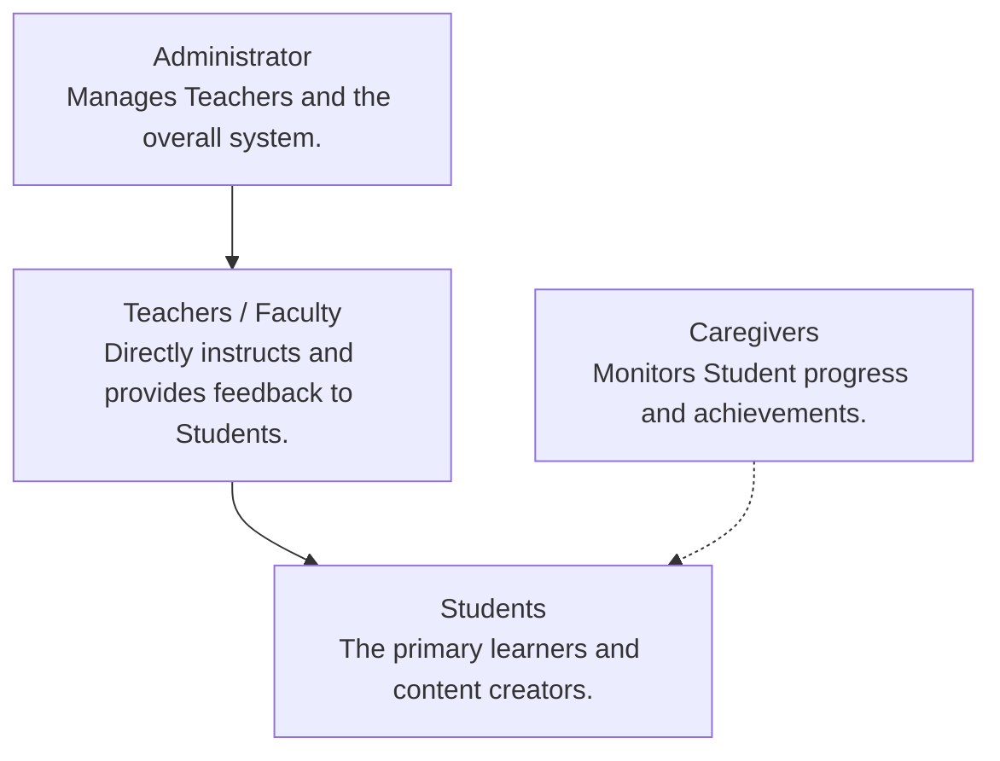

---

### 3.3 Statement of the Mission/Goal of the Organization 
"RangKala Art Academy is dedicated to nurturing creativity and providing structured, engaging, and professional art education through both online and offline platforms." 

Colours, creativity & fun – Discover the artist in you at RangKala Art Academy!  

Unlock your creativity with RangKala Art Academy by Supriya Kumar – where kids and Caregivers explore the joy of art together!  

From shading, watercolour, oil pastels, and acrylics to landscape painting, mandala, doodle, Madhubani, and Warli, we make learning art a fun-filled experience. 
Along with art, small kids also learn beautiful cursive English writing, building confidence and skills for life.  

Build skills, express yourself, and enjoy a colourful journey of imagination – all in a friendly, inspiring space right in your community  

---

### 3.4 Project Request  
RangKala Art Academy seeks to modernize and streamline its core operations, particularly in managing art competitions and issuing certificates. The client, Supriya Kumar, envisions a structured and engaging digital platform that aligns with the academy’s mission of nurturing creativity and providing organized art education. 

This project proposes the development of a custom web-based system designed to automate time-consuming administrative tasks, simplify competition management, and improve the overall user experience for students, teachers, and Caregivers. The platform will enable students to register for competitions, upload their artwork, and automatically receive certificates for participation and achievements. 

The proposed system will include an admin and teacher dashboard for managing competitions, defining rules, and handling scoring, while students will have personalized dashboards to track submissions, feedback, and certificates.  Caregivers will also be able to monitor their child’s activities and progress. By replacing manual processes with a centralized digital solution, the system aims to enhance efficiency, transparency, and engagement within the academy.

  Ultimately, this project will reduce administrative workload, minimize errors, and create a more interactive and organized environment that supports RangKala Art Academy’s vision of fostering artistic growth through technology. 

---

### 3.5 Description of the Problem 
RangKala Art Academy is currently handling most of its work manually, such as registering students, organizing art competitions, and giving out certificates. This process takes a lot of time and can easily lead to mistakes or delays. 

As more students join and more events are held, it becomes harder for the academy to manage everything properly.  There is no proper online system where all this information can be stored and managed in one place, which makes things even more difficult. 

Communication is also a problem because most updates are shared through chat messages or phone calls.  Sometimes important information is missed or forgotten, which affects both students and Caregivers.  Caregivers find it hard to know how their children are doing, while students don’t have a platform where they can see their artwork, progress, and certificates.  Everything is scattered, and it’s not easy to track improvements or achievements over time.  

 Since everything is done manually, the academy struggles to stay organized and efficient.   Keeping records in files or different folders takes too much effort, and it’s hard to find information when needed.  As the academy grows, this way of working will only create more problems.   Because of this, there is a need for a web-based system that can make these tasks easier, faster, and more organized. The system will help automate competition management, certificate generation, and record-keeping while also improving communication between students, teachers, and Caregivers.  

 ---

### 3.6 Project Scopes and Constraints 
This section outlines the specific functionalities, features, and deliverables of the RangKala Art Academy system project.  It defines the project’s boundaries and limitations, ensuring a clear understanding among the development team, the client, and stakeholders.

---

## 3.6.1 Project Scopes  
* **Scope 1: Website Design and Interface**
  The aim is to develop a  **effective, visually cohesive, and browser-optimized** online platform for RangKala Art Academy.

* **Usability Standard:**

  * The interface must achieve a **near-zero learning curve**, enabling users to successfully complete primary tasks (e.g., Student portfolio upload, Caregiver registration) on the first attempt without instruction.
  * The platform will be **optimized for desktop and laptop web browsers**, ensuring smooth performance and usability across modern browsers (e.g., Chrome, Edge, Firefox).
  * System navigation must be based on **familiar design conventions** and **recognition over recall** for maximum efficiency.

* **Role-Specific Access & Efficiency:** Provide secure, separate logins and task-optimized dashboards for four distinct user roles: Admin, Teacher, Student, and Caregiver. Each dashboard must prioritize core functions to maximize user efficiency.

* **UI Framework:** The system shall implement the user interface using Tailwind CSS to ensure consistency, usability, and accessibility across desktop environments. Tailwind's utility-first approach will enable rapid development of custom components that align with the academy's artistic identity.

* **Essential Website Pages:** The platform must include the following essential, well-structured pages and modules:

  * Home
  * Registration (Designed with clear guidance and error prevention)
  * Competitions
  * Gallery
  * Dashboards
  * Certificates

* **Aesthetic & Consistency:** Ensure the interface is visually appealing, maintains clear visual hierarchy, and is entirely consistent with the academy's artistic identity and branding.

* **Scope Limitation:** Mobile responsiveness is considered out of scope for this version and may be addressed in future iterations.
* **Scope 2: User and Data Management**  
The system will facilitate secure user registration, authentication, and profile management for all user types.  
    * Implement role-based access for students, Caregivers, and teachers.  
    * Allow users to update personal details (including name, reset passwords, and manage sessions).  
    * Include options for account deactivation requests and proper data handling.  
    * Maintain accurate and secure user records within a centralized database.  

* **Scope 3: Competition and Artwork Management**  
This scope focuses on managing art competitions efficiently through a digital system, minimizing administrative and grading time.

* **Competition Creation and Management:** Allow teachers or administrators to create, edit, and manage competitions with defined rules, deadlines, and scoring criteria **using streamlined, template-based workflows** (maximizing setup efficiency).
* **Student Submission:** Enable students to upload **multiple artworks per competition** in multiple formats (images) and view competition details. The system must process submissions and confirm uploads within **5 seconds** (ensuring student efficiency).
* **Grading and Feedback Tools:** Provide judges with tools to review submissions, assign scores, and offer **structured, defined feedback**.
* **Systematic Storage and Retrieval:** Store all submissions **systematically** (tagged by competition, student, and date) for easy retrieval and evaluation. The submission archive must be searchable and retrievable within **5 seconds** (ensuring administrative data efficiency).

* **Scope 4: Portfolio, Certificates, and Caregiver Monitoring**  
The system will help track student progress, achievements, and Caregiver engagement.  
    * Generate automated digital certificates for competition winners and participants, **explicitly linked to specific artworks**.  
    * Allow students to maintain a personal portfolio showcasing artworks categorized by art style and submission date.  
    * Provide Caregivers with access to their child's progress, including submissions, feedback, and awards.  
    * Offer transparent performance tracking for both students and Caregivers.  

* **Scope 5: Notifications, Reports, and Payments**  
This section covers communication, analytics, and financial features within the system.  
    * Send real-time notifications for new competitions, deadlines, results, and important updates.  
    * Generate reports and analytics on participation trends, competition outcomes, and student performance.  
    * Integrate a secure online payment system for competition registrations and workshop fees, **following the enrollment process**.  

* **Scope 6: Security, Maintenance, and Future Enhancements**

* **Authentication**  
The system will enforce robust security through strong password policies requiring 14+ characters with complexity requirements, automatic logout after 15 minutes of inactivity, and role-based access controls with tiered admin privileges. Sensitive operations will require secondary approval, failed login attempts will trigger account lockout after 5 failures, and comprehensive audit logs will be maintained for all user activities.

* **Data Protection**  
All data will be secured using AES-256 encryption at rest and TLS 1.3 for in-transit protection, with regular encrypted backups stored offsite and tested monthly through restoration procedures. The system will collect only essential user information, anonymize data in non-production environments, establish clear retention and deletion policies, maintain compliance with GDPR and FERPA regulations, and implement documented breach response procedures.

* **Maintenance & Future Enhancements**  
Comprehensive user manuals will be created for administrators and teachers, while the architecture will be designed with modularity and scalability in mind. APIs will be implemented to enable future integrations, regular security patching will be scheduled, periodic vulnerability assessments will be conducted, and infrastructure will be prepared to support AI-based features and mobile application compatibility.

* **Data Integrity Controls**  
    * **Certificate Management:** Implement soft deletion with strict access controls and audit trails for any certificate modifications or deletions. Certificates should generally not be deleted as they represent official achievements.
    * **Payment Management:** Financial records will never be permanently deleted. Soft deletion with multi-authorization requirements and comprehensive audit trails will be maintained for all payment modifications.

---

#### 3.6.2 Project Constraints  
This part outlines the limitations and boundaries that may impact the development and implementation of the project. These constraints include various aspects such as time, technology, and external factors that could potentially affect the project's scope and success  
* **Budgetary Constraint**: The project has a limited budget, which means we may not be able to use advanced technologies like artificial intelligence for evaluating artworks or expensive cloud hosting services. Most development will rely on affordable or free tools, which may limit some features initially. 
* **Technical Constraint**: The system will need a stable internet connection to work properly.  Features like real-time artwork uploads, competition updates, and automatic certificate generation may not work smoothly if the connection is slow or unstable. 
* **Resource Constraint**: Development will primarily use free or open-source frameworks, libraries, and tools to reduce costs. This means some advanced functionalities or custom designs might take longer to implement or be simplified compared to high-end paid solutions. 
* **Time Constraint**: The project must be completed within the academic term. This limits the time available for extensive testing, feature additions, or major revisions. The system will be designed to meet core requirements first, with potential improvements added later.  
* **Security and Privacy**: Since the website will store personal information about children, including their names, artworks, and competition results, the system must follow data protection laws and privacy standards. Proper consent from Caregivers or guardians must be ensured, and measures like secure logins and safe storage of data are essential to protect sensitive information. 

---

### 3.7 Expected Business Benefits 
The proposed digital platform will bring significant improvements to RangKala Art Academy’s overall operations and performance. By introducing automation and centralized management, the system will streamline competition and student management, making it easier for administrators and teachers to organize events, handle submissions, and manage scoring without the inefficiencies of manual work. 

The platform will also increase student engagement by allowing learners to upload their artwork, explore different art styles, and receive feedback directly through the system. This interactive and Caregiver process encourages creativity and continuous participation. Moreover, the system will open new revenue opportunities by enabling online competitions and workshops, allowing the academy to reach a wider audience beyond its physical location. 

In addition, automating administrative processes will result in substantial time and cost savings, reducing paperwork and minimizing errors while allowing staff to focus on academic and creative priorities.Finally, the new web-based system will establish a professional digital presence for RangKala Art Academy, showcasing its modern approach to art education and enhancing its reputation within the artistic community.

---

### 3.8 Expected System Capabilities 

* **1. Competition Management Module** 
    * Allow teachers and administrators to create, edit, and delete competitions. 
    * Define competition details such as title, description, rules, categories, and judging criteria. 
    * Assign judges (teachers) to each competition.
    * Manage competition timelines, participant lists, and scoring.
    * Display competition status (Upcoming, Ongoing, Completed) for easy tracking.  

* **2. Certificate Management Module**  
    * On-Demnad generation of certificates for participants , once competition results are finalized.  
    * Include the organization's digital signature, and optionally, partner organization or supervising teacher's signature.  
    * Store and link all certificates to the respective student's profile and specific artwork for future access and downloads.  
    * Allow administrators to customize certificate templates with competition details and logos.  
    * Implement soft deletion with strict access controls and audit trails for any certificate modifications or deletions.  

* **3. Student Artwork Management System** 
    * **Student Access & Dashboard**:
        * Provide students with secure login access to their personalized dashboard
        * Display uploaded artworks, competition participation history, feedback, and earned certificates
        * Allow students to edit basic profile details and view progress over time
    
    * **Portfolio Management**:
        * Maintain a digital portfolio that can be viewed and updated anytime
        * Categorize artworks by style (Sketching, Watercolour, Digital Art, etc.)
        * Facilitate better organization and easier browsing for students and judges
    
    * **Artwork Submission**:
        * Allow students to upload multiple artworks per competition in accepted file formats (JPG, PNG)
        * Ensure secure and efficient storage of uploaded files
        * Validate file size and type to maintain quality and compatibility
        * Process submissions within 5 seconds with confirmation
    
    * **Historical Tracking**:
        * Display all previous artwork submissions with upload date, time, and status
        * Enable sorting/filtering by competition, art style, or submission date
        * Allow teachers to add comments or updates to previously submitted works
        * Provide searchable archive within 5 second retrieval time

* **4. Caregiver Monitoring Module**  
    * Enable Caregivers to log in and monitor their child's art activities, submissions, and achievements.  
    * Provide a summary view of participation history, awards, and feedback received.  
    * Send notifications or updates on upcoming competitions and results.  

* **5. Payment Management Module** 
    * **Secure Payment Processing**: Integrate Stripe to handle secure online payments for competition registrations, workshops, and paid services following the enrollment process.  
    * **Automated Receipt Generation**: Instantly generate payment receipts linked to student profiles upon transaction completion.  
    * **Financial Transparency**: Maintain comprehensive transaction histories for each user with searchable records.  
    * **Real-time Notifications**: Automatically notify students and Caregivers of payment statuses (successful, pending, or failed) via email/SMS.  
    * **Financial Record Integrity**: Implement soft deletion with multi-authorization requirements and comprehensive audit trails for all payment modifications.

---

### 3.9 Development Environment 
This section outlines the development environment for the RangKala Art Academy Web Platform, an online system built to modernize competition management, automate certificate generation, and improve engagement between students, teachers, and Caregivers.The environment combines efficient open-source tools that support scalability, security, and maintainability throughout development. 

---

### Software Requirements

* **Operating System:**  
The system will be developed on **Windows 11**, as it is the operating system installed on the developer’s laptop. Windows provides a stable and reliable environment for PHP, Laravel, MySQL, and related tools, allowing efficient local development, testing, and configuration throughout the project.

* **Web Server**: The local development will use **Laragon**, an integrated web development environment that bundles Apache, PHP, and MySQL. Laragon is preferred over XAMPP due to its faster performance, automatic virtual host configuration, and better integration with Laravel projects.  For production, the project will be deployed to a **cloud-based web server** such as Hostinger that supports PHP and MySQL.
* **PHP Version**: The system will use **PHP 8.3.9**, fully compatible with **Laravel 10**, ensuring access to the latest security features and performance improvements. PHP will handle server-side logic, data processing, and communication between the front end and the database. 
* **Composer**: **Composer** will serve as the package manager for Laravel dependencies. It simplifies installation, updates, and management of third-party libraries required for the project.  
* **Frontend Technologies**: The front end will be built using **HTML5, CSS3**, and **JavaScript** to create a structured and responsive layout. UI Framework: The system shall implement the user interface using Tailwind CSS to ensure consistency, usability, and accessibility across devices. Tailwind's utility-first approach will enable rapid development of custom components that align with the academy's artistic identity
* **Backend Technologies**: The back end will be powered by the **Laravel Framework**, built on PHP.   It will handle routing, form submissions, authentication, and database operations.  Laravel’s built-in **Eloquent ORM** will provide efficient and secure interaction with the database while minimizing manual SQL queries. 
* **Database**: The project will use **MySQL**, a reliable relational database management system (RDBMS), to store and manage user information, competition details, uploaded artworks, and generated certificates.Regular backups are handled as part of system maintenance using **MySQL Workbench**, which connects to the MySQL server in Laragon. Since backup and restoration are administrative maintenance tasks rather than end-user functions, they are implemented outside the system rather than as an internal admin feature.

* **Version Control**: **Git** will be used for version control, with the repository hosted on **GitHub**.   This will ensure collaborative development, code version tracking, and backup throughout the project lifecycle.  
* **Design Tools**: **Figma** and **Canva** will be used for UI/UX design and prototyping. These tools will assist in creating wireframes, layouts, and visual elements that align with the academy’s branding and usability goals. 
---
**Development Workflow:**  
* **Local Development**: The project will first be developed locally using **Laragon**, which provides a complete stack (Apache, PHP, MySQL) for Laravel applications. **Visual Studio Code (VS Code)** will serve as the main development editor, offering syntax highlighting, Laravel integration, and debugging features.  During this phase, **Composer** will be used for Laravel dependencies, and Node.js will handle asset compilation. **GitHub** will track all code changes and maintain version history for easy collaboration and rollback if needed.
* **Production Deployment**: Once development and testing are complete, the system will be deployed on a cloud hosting platform that supports PHP and MySQL. The deployment will include transferring all project files, migrating the database, and configuring environment variables in the **.env** file.A **custom domain** with an SSL certificate will be set up to ensure secure access through HTTPS. The production server will also support automated backups and scheduled maintenance updates to maintain reliability and uptime.

--- 

**Security:**  
* **Authentication and Authorization**: Laravel’s built-in authentication system will be used to create a secure login process and manage access based on user roles (Admin, Teacher, Student, Caregiver). This ensures that each user only has access to features relevant to their role. 
* **Input Validation and Sanitization**: All user inputs will be validated using Laravel’s validation methods to prevent **SQL Injection, Cross-Site Scripting (XSS)**, and other security vulnerabilities. 
* **Data Encryption**: Sensitive data such as passwords will be stored in an encrypted format using Laravel’s built-in hashing mechanism to ensure data confidentiality. 
* **Regular Security Updates**: Laravel, PHP, and all dependencies will be regularly updated to their latest versions to protect against potential security threats and vulnerabilities.  
 ---

**Testing:**
* **Unit Testing**: Conducted using **PHPUnit**, Laravel’s native testing framework, to ensure each component works correctly and independently.  
* **Integration Testing**: Validates that interconnected modules such as authentication, competition setup, artwork upload, and certificate generation work together seamlessly after individual units have been tested.  
* **Functional Testing**: Ensures that end-to-end features behave according to requirements from a user perspective, including competition creation, artwork submission, and certificate generation.  
* **Performance Testing**: Evaluates how the system handles concurrent users and file uploads to ensure stable performance under normal usage conditions.  
* **Cross-Browser and Mobile Testing**: Tests the application on modern browsers (Chrome, Firefox, Edge) and multiple screen sizes to ensure consistent responsiveness and usability.  
* **User Acceptance Testing (UAT)**: Conducted with selected teachers and students to verify that the system meets user expectations before deployment.

---  

### 3.10 Feasibility Study  
The Feasibility Study assesses the practicality, sustainability, and long-term viability of developing and implementing the RangKala Art Academy Web Platform.  This study evaluates the project’s technical, legal, operational, schedule, and financial feasibility to ensure it can be successfully executed within the given constraints. The findings confirm that the proposed system is both achievable and beneficial, aligning with the academy’s mission to modernize and simplify art competition and learning management. 

---

#### 3.10.1 Technical Feasibility 
* **Existing Technology**: The proposed system will be developed using established web technologies such as HTML5, CSS3, JavaScript, and the Laravel PHP Framework, ensuring a robust and scalable foundation. Laravel’s built-in tools for routing, authentication, and database management make it suitable for this project’s needs.  
* **Development Environment**: Development will take place locally using Laragon, which integrates Apache, PHP, and MySQL into one efficient stack. This environment allows for smooth configuration, fast performance, and simple database management. Composer will be used to handle Laravel dependencies, while Node.js will assist in compiling and optimizing front-end assets. 
* **Available Expertise**: The developer possesses experience in web development, PHP, Laravel, and MySQL, ensuring the project’s technical requirements can be met. Additional guidance will be provided by the project advisor and client to maintain alignment with the academy’s goals.  
* **Hosting Infrastructure**: The completed system will be hosted on a cloud-based web server which is going to be Hostinger which supports PHP and MySQL.   Cloud hosting will ensure high availability, data security, and scalability to accommodate future user growth.  
* **Integration Potential**: The system is designed to operate independently, with built-in integration for payment gateways to handle transactions. Additionally, it is flexible enough to support future integration with other external services, such as email notifications or certificate verification APIs, without requiring major changes to the existing architecture. This design ensures both current functionality and scalability for future enhancements.

* **Scalability**: The use of Laravel and MySQL enables the system to handle a growing number of users, artworks, and competitions. The modular structure allows new features, such as online workshops or gallery exhibitions, to be added easily as the academy expands. 
* **Security**: Laravel provides strong security measures, including CSRF protection, input validation, password hashing, and role-based access control. These ensure that user accounts, payment details, and student data are safeguarded from unauthorized access or manipulation. 

---

#### 3.10.2 Legal Feasibility 
The RangKala Art Academy Web Platform will comply with relevant Indian data protection and IT regulations, ensuring secure and lawful data handling.

* The project adheres to the Information Technology Act, 2000 (IT Act) and IT Rules 2011, which govern electronic records, digital signatures, and data protection. 
* Furthermore, the system will align with the Personal Data Protection Bill (India) to ensure Caregiveral consent and protection of minors’ data.
* For online payments, compliance with the Reserve Bank of India (RBI) digital payment security guidelines will be maintained. 
*  Encryption, secure authentication, and restricted data access will be implemented to protect all financial transactions.
The system will implement appropriate data protection measures to ensure the privacy and security of student information in accordance with local laws and institutional policies.

---

#### 3.10.3 Operational Feasibility 
* **User-Friendliness**: The platform will feature a simple and intuitive interface designed with **Bootstrap 5**, ensuring easy navigation for teachers, students, and Caregivers. Minimal training will be required, allowing users to adapt quickly. 
* **Alignment with Existing Processes**: The proposed system complements the academy’s existing workflow for managing competitions, collecting artworks, and awarding certificates.This continuity minimizes disruptions and encourages acceptance among staff and students. 
* **Change Management Plan**: To ensure a smooth transition from manual to digital operations, the system will be introduced in phases. Initial adoption will focus on competition management and certificate generation, followed by student portfolios and Caregiver dashboards.  Basic training sessions will be provided for teachers and staff to ensure effective system use. 
* **Administrative Support**: The project is fully supported by the client, **Supriya Kumar**, Director of RangKala Art Academy, who will provide continuous feedback and data inputs during development. This ensures the system meets both administrative and educational objectives. 
 --- 

#### 3.10.4 Schedule Feasibility 
Based on the proposed timeline, the system’s total development duration is estimated at **approximately 16 weeks (4 months)**. This schedule includes requirement analysis, design, coding, testing, and deployment phases. A one-week buffer has been included to accommodate feedback, revisions, and testing adjustments. Given the limited project scope and the developer’s familiarity with Laravel, the estimated schedule is both realistic and achievable within the academic term.

---

### 3.10.5 Financial Feasibility  

The project is primarily academic and will incur minimal financial cost as part of a student development project. The estimated expenses for real-world implementation are:  
* Requirement Analysis & Design: **₹5,000** (~ **$57 USD**)  
* Development & Testing: **₹15,000** (~ **$170 USD**)  
* Deployment & Maintenance: **₹10,000** (~ **$114 USD**)  

*Conversion rate used: 1 INR = 0.0114 USD (rate as of November 19, 2025, [exchangerates.org.uk](https://www.exchangerates.org.uk/INR-USD-spot-exchange-rates-history-2025.html))*

The system uses open-source technologies such as Laravel, PHP, MySQL, and Laragon. There are no licensing or subscription costs. Expected additional expenses include domain registration, cloud hosting, and SSL certification. The overall financial risk is low, and the project is highly feasible and cost-effective for long-term use.

### Estimation Model

The cost estimates were calculated using a **bottom-up approach**, considering each project phase: requirement analysis, design, development, testing, deployment, and maintenance. Labor cost is based on student-level effort, with small buffers included in deployment and maintenance to cover minor additional expenses. The use of open-source tools reduces financial overhead, maintaining low overall risk.
  

---

### 3.11 Planning  

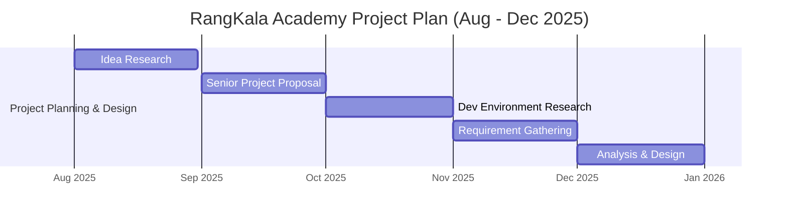

1. **Idea Research (August 2025)**: 
The project starts with brainstorming and exploring innovative concepts.
Teams evaluate feasibility and originality before shortlisting potential ideas.
2. **Senior Project Proposal (September 2025)**
The selected ideas are formalized into detailed proposals.
These proposals are then submitted for review and approval by the project supervisor and panel.
3. **Development Environment Research (October 2025)**
Research is conducted to identify appropriate tools, programming languages, platforms, and frameworks.
This ensures the chosen technologies align with the project’s objectives and constraints.
4. **Requirement Gathering (November 2025)**
The team defines functional and non-functional requirements.
This process includes stakeholder analysis to ensure all user and system needs are documented.
5. **Analysis & Design (December 2025)**
Risk Analysis:  Potential project risks are identified, assessed, and documented, with mitigation strategies to minimize their impact on schedule, quality, and overall success.
System Design: The system’s technical architecture and database schema are planned. UML diagrams, including use case, class, and sequence diagrams, are used as tools to visualize structure, component interactions, and workflow logic, guiding the implementation phase and ensuring requirements are met.

---
## 4. Analysis and Design  

### 4.1 Introduction 
The Analysis and Design section outlines the structured approach taken to develop the RangKala Art Academy Web Platform. This stage focuses on analyzing the academy’s operational requirements and translating them into a functional, efficient, and user-friendly digital solution. 

By understanding the needs of the academy, including competition management, student engagement, and certificate automation, this section ensures the system’s design aligns with the institution’s goal of enhancing creativity and administrative efficiency.

 The design phase aims to create a clear and scalable system architecture that connects students, teachers, and Caregivers through a centralized online platform.The system follows best practices in web application development and leverages the Laravel Framework for reliability, security, and modular design. 
 
 This approach ensures that every system component from competition setup to certificate generation works cohesively to deliver an engaging and seamless experience for all users. 

---

### 4.2 Risk Analysis  
The Risk Analysis identifies potential issues that may arise during the design, development, and deployment phases of the RangKala Art Academy Web Platform.  These risks include technical, management, human resource, and quality assurance challenges that could affect project performance or schedule. 

 Evaluating these risks based on their likelihood and impact enables proactive mitigation and contingency planning, ensuring the project progresses smoothly and meets its objectives.  

#### 4.2.1 Risks Table  

| Risk ID | Risk | Risk Category | Likelihood | Impact |
| :--- | :--- | :--- | :--- | :--- |
| R001 | Overwork and Burnout | Human Resource | High | High |
| R002 | Scope Creep | Management | Moderate | High |
| R003 | Insufficient Testing | Quality Assurance | Moderate | High |
| R004 | Documentation Deficiency | Quality Assurance | Moderate | Moderate |
| R005 | Time Constraints | Management | Moderate | High |
| R006 | Insufficient Technical Knowledge | Technical | Moderate | High |
| R007 | Change in Technology | Technical | Low | Moderate |
| R008 | Change in Requirements | Management | Moderate | High |
| R009 | Storage Limit Reached | Technical | Moderate | High |
| R010 | File Upload Malware or Viruses | Security | Moderate | High |
| R011 | Payment Gateway Downtime or Failure | Technical | Low | High |
| R012 | Slow Loading on Desktop Devices | Performance | Moderate | Moderate |
| R013 | Data Privacy for Minors (India DPDP Act 2023) | Legal/Compliance | Moderate | High |

---

**R001 – Overwork and Burnout**

| Risk | Overwork and Burnout |
| :--- | :--- |
| Category | Human Resource |
| Likelihood | High |
| Impact | High |
| Description | The risk of fatigue due to managing multiple project responsibilities individually, which may lead to reduced productivity and decreased focus. |
| Monitoring | Regularly track workload and development milestones using project management tools. |
| Mitigation Plan | Maintain a structured work schedule, include rest periods, and follow a balanced development timeline. |
| Contingency Plan | If burnout occurs, redistribute tasks, extend deadlines if necessary, and seek temporary support from peers or mentors. |

**R002 – Scope Creep**

| Risk | Scope Creep |
| :--- | :--- |
| Category | Management |
| Likelihood | Moderate |
| Impact | High |
| Description | The tendency for the project scope to expand beyond initial requirements, leading to increased workload and possible delays. |
| Monitoring | Conduct weekly progress reviews and maintain documentation of all approved features. |
| Mitigation Plan | Clearly define project boundaries during the requirement phase and implement a strict change control process. |
| Contingency Plan | If scope creep occurs, reassess project priorities, negotiate revised requirements, and adjust timelines and resources accordingly. |

**R003 – Insufficient Testing**

| Risk | Insufficient Testing |
| :--- | :--- |
| Category | Quality Assurance |
| Likelihood | Moderate |
| Impact | High |
| Description | Inadequate testing may result in undetected bugs or functional errors that could affect system performance after deployment. |
| Monitoring | Maintain a detailed testing log and run tests after every major update. |
| Mitigation Plan | Allocate sufficient time for unit, integration, and user acceptance testing. |
| Contingency Plan | If critical bugs are detected late, prioritize fixes, conduct additional regression testing, and communicate delays to stakeholders. |

**R004 – Documentation Deficiency**

| Risk | Documentation Deficiency |
| :--- | :--- |
| Category | Quality Assurance |
| Likelihood | Moderate |
| Impact | Moderate |
| Description | Incomplete or outdated documentation could make it difficult to understand, maintain, or upgrade the project in the future. |
| Monitoring | Review and update project documentation weekly. |
| Mitigation Plan | Dedicate scheduled time for documentation and use version control (GitHub) to store and track revisions. |
| Contingency Plan | If critical documentation gaps are discovered, schedule a focused documentation sprint and update records immediately. |

**R005 – Time Constraints**

| Risk | Time Constraints |
| :--- | :--- |
| Category | Management |
| Likelihood | Moderate |
| Impact | High |
| Description | The risk of missing project deadlines due to complexity, unplanned delays, or unforeseen technical challenges. |
| Monitoring | Track progress regularly using Gantt chart and project management tools. |
| Mitigation Plan | Set achievable milestones, include buffer time in the schedule, and prioritize high-impact tasks. |
| Contingency Plan | If deadlines are at risk, adjust priorities, request extensions, or seek additional support to complete critical tasks. |

**R006 – Insufficient Technical Knowledge**

| Risk | Insufficient Technical Knowledge |
| :--- | :--- |
| Category | Technical |
| Likelihood | Moderate |
| Impact | High |
| Description | Limited familiarity with specific Laravel or MySQL features could slow development or cause implementation difficulties. |
| Monitoring | Track challenges faced during development and document learning outcomes. |
| Mitigation Plan | Allocate time for research, consult Laravel documentation, and seek guidance from experienced developers or communities. |
| Contingency Plan | If knowledge gaps cause delays, assign simpler tasks temporarily, seek mentorship, or adjust the schedule to allow learning time. |

**R007 – Change in Technology**

| Risk | Change in Technology |
| :--- | :--- |
| Category | Technical |
| Likelihood | Low |
| Impact | Moderate |
| Description | The emergence of newer technologies or major framework updates may require code adjustments during development. |
| Monitoring | Keep track of Laravel updates and technology trends. |
| Mitigation Plan | Keep the system modular and flexible for easier adoption of new technologies. |
| Contingency Plan | If a major update occurs, assess the impact, delay implementation if necessary, and update only critical components immediately. |

**R008 – Change in Requirements**

| Risk | Change in Requirements |
| :--- | :--- |
| Category | Management |
| Likelihood | Moderate |
| Impact | High |
| Description | Changes in project requirements from the client or academy management could cause rework or timeline extensions. |
| Monitoring | Conduct regular meetings with the client (Supriya Kumar) to ensure alignment on objectives and deliverables. |
| Mitigation Plan | Use a formal change request process and assess time, cost, and resource implications before adjusting. |
| Contingency Plan | If significant changes are introduced, reprioritize tasks, adjust the timeline, and communicate implications to all stakeholders. |

**R009 – Storage Limit Reached**

| Risk | Storage Limit Reached |
| :--- | :--- |
| Category | Technical |
| Likelihood | Moderate |
| Impact | High |
| Description | The system may reach storage capacity limits due to the large volume of high-resolution art images uploaded by students, potentially causing service disruption or requiring costly storage upgrades. |
| Monitoring | Regularly monitor storage usage and set up alerts when approaching capacity thresholds. |
| Mitigation Plan | Implement efficient image compression, set storage quotas per user, and establish a clear data retention policy. |
| Contingency Plan | If storage limits are reached, immediately implement temporary storage expansion, notify users of upload restrictions, and expedite plans for permanent storage solution upgrades. |

**R010 – File Upload Malware or Viruses**

| Risk | File Upload Malware or Viruses |
| :--- | :--- |
| Category | Security |
| Likelihood | Moderate |
| Impact | High |
| Description | Malicious files uploaded as artwork could compromise system security, infect other users' devices, or lead to data breaches. |
| Monitoring | Implement automated virus scanning for all uploaded files and maintain logs of upload activities. |
| Mitigation Plan | Restrict file types to image formats only, implement file size limits, and use robust antivirus software to scan all uploads. |
| Contingency Plan | If malware is detected, immediately quarantine affected files, notify affected users, conduct a security audit, and enhance upload validation protocols. |

**R011 – Payment Gateway Downtime or Failure**

| Risk | Payment Gateway Downtime or Failure |
| :--- | :--- |
| Category | Technical |
| Likelihood | Low |
| Impact | High |
| Description | Failures in the Stripe payment gateway could prevent users from registering for paid competitions or workshops, resulting in lost revenue and user frustration. |
| Monitoring | Monitor payment gateway status through Stripe's service status page and set up alerts for transaction failures. |
| Mitigation Plan | Implement retry mechanisms for failed transactions, maintain clear communication with users during outages, and have a backup payment processor ready if feasible. |
| Contingency Plan | If extended downtime occurs, temporarily suspend paid competition registrations, provide alternative payment methods if possible, and extend registration deadlines as needed. |

**R012 – Slow Loading on Desktop Devices**

| Risk | Slow Loading on Desktop Devices |
| :--- | :--- |
| Category | Performance |
| Likelihood | Moderate |
| Impact | Moderate |
| Description | Large image files and complex interfaces could cause slow loading times, leading to poor user experience and reduced engagement. |
| Monitoring | Regularly test page load speeds and monitor user experience metrics. |
| Mitigation Plan | Optimize images for web use, implement lazy loading, use efficient caching strategies, and minimize unnecessary scripts. |
| Contingency Plan | If slow loading becomes widespread, implement performance optimizations immediately, temporarily reduce image quality settings, and consider upgrading hosting resources. |

**R013 – Data Privacy for Minors (India DPDP Act 2023)**

| Risk | Data Privacy for Minors (India DPDP Act 2023) |
| :--- | :--- |
| Category | Legal/Compliance |
| Likelihood | Moderate |
| Impact | High |
| Description | Failure to comply with India's Digital Personal Data Protection Act 2023 regarding minors' data could result in legal penalties, reputational damage, and loss of trust. |
| Monitoring | Regularly review compliance with DPDP Act requirements and conduct privacy impact assessments. |
| Mitigation Plan | Obtain verifiable parental consent for data collection from minors, implement strict access controls, and ensure data minimization practices. |
| Contingency Plan | If a compliance issue is identified, immediately rectify the violation, notify relevant authorities as required, review and enhance data protection measures, and provide transparency to affected users. |

---
#### 4.2.2 Development Environment 
This section outlines the development environment for the RangKala Art Academy Management System, a web-based application designed to modernize and streamline the academy’s operations by automating art competitions, certificate generation, and portfolio management for students.  

#### 4.2.2 Development Environment

The technical implementation environment follows the comprehensive specifications detailed in [Section 3.9](#39-development-environment). All development tools, frameworks, and infrastructure requirements are fully documented there, including:
- Language specifications (PHP, JavaScript)
- Development tools (Laravel, VS Code, Composer)
- Database architecture (MySQL)
- Design and version control systems (Figma, GitHub)

---
#### ERD Diagram

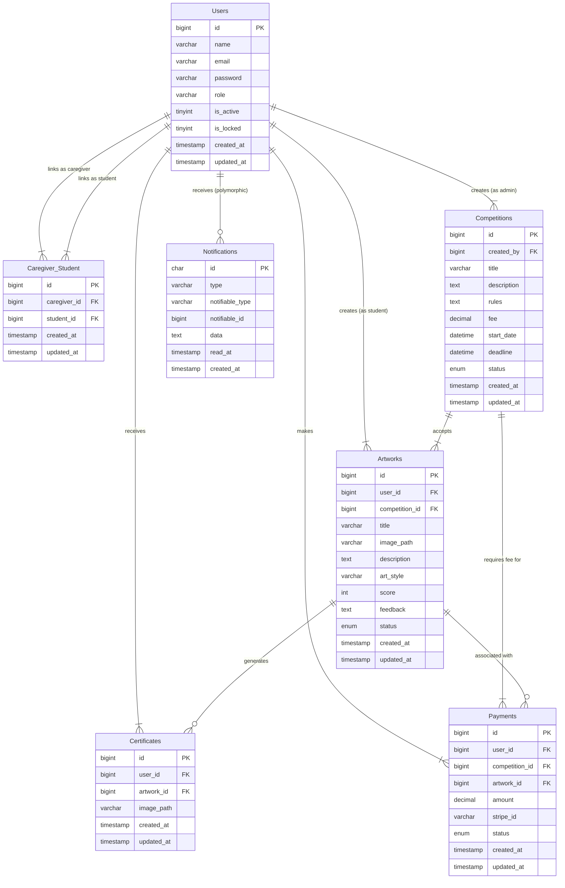

Here is the updated **Database Overview**, revised to accurately reflect your actual MySQL schema structure:

#### Database Overview

* **Users**
  - Purpose: Consolidated table storing all user accounts (Students, Caregivers, Teachers, and Admins) differentiated by a role column.
  - Key Attributes:
    - `id` – Primary key (bigint unsigned).
    - `name`, `email`, `password` – Basic account information.
    - `role` – Defines user type (e.g., 'student', 'teacher', 'admin').
    - `is_active` – Account status flag.
    - `is_locked` – Security lockout flag.
    - `failed_login_attempts` – Security tracking.
    - `created_at`, `updated_at` – Timestamps.

* **Caregiver_Student**
  - Purpose: Junction table establishing Many-to-Many relationships between Caregivers and Students (referencing the `Users` table).
  - Key Attributes:
    - `id` – Primary key (bigint unsigned).
    - `caregiver_id` – Foreign key to Users (bigint unsigned).
    - `student_id` – Foreign key to Users (bigint unsigned).
    - `created_at`, `updated_at` – Timestamps.

* **Competitions**
  - Purpose: Stores information about art competitions and their rules.
  - Key Attributes:
    - `id` – Primary key (bigint unsigned).
    - `created_by` – Foreign key to Users (Admin who created it).
    - `title` – Name of the competition.
    - `description` – Details about the competition.
    - `rules` – Specific instructions.
    - `fee` – Registration cost (decimal).
    - `start_date`, `deadline` – Schedule datetimes.
    - `status` – Enum ('upcoming', 'ongoing', 'completed').
    - `created_at`, `updated_at` – Timestamps.

* **Artworks**
  - Purpose: Stores metadata and review data for artworks submitted by Users.
  - Key Attributes:
    - `id` – Primary key (bigint unsigned).
    - `user_id` – Foreign key to Users (Student).
    - `competition_id` – Foreign key to Competitions.
    - `image_path` – Path to the artwork file.
    - `title` – Artwork title.
    - `description` – Artwork description.
    - `art_style` – Category of artwork.
    - `score` – Review score (int).
    - `feedback` – Review comments (text).
    - `status` – Enum ('pending', 'reviewed').
    - `created_at`, `updated_at` – Timestamps.

* **Certificates**
  - Purpose: Tracks certificates generated for specific Users and Artworks.
  - Key Attributes:
    - `id` – Primary key (bigint unsigned).
    - `user_id` – Foreign key to Users (Recipient).
    - `artwork_id` – Foreign key to Artworks (Context).
    - `image_path` – Path to the generated certificate file.
    - `deleted_at` – Soft delete timestamp.
    - `created_at`, `updated_at` – Timestamps.

* **Payments**
  - Purpose: Records transaction details for competition fees, linked to Stripe.
  - Key Attributes:
    - `id` – Primary key (bigint unsigned).
    - `user_id` – Foreign key to Users (Payer).
    - `competition_id` – Foreign key to Competitions.
    - `artwork_id` – Foreign key to Artworks (Specific submission).
    - `stripe_id` – External Stripe transaction ID.
    - `amount` – Payment amount (decimal).
    - `currency` – Currency code (e.g., 'INR').
    - `status` – Enum ('pending', 'completed', 'failed', 'refunded').
    - `receipt_path` – Path to the payment receipt.
    - `deleted_at` – Soft delete timestamp.
    - `created_at`, `updated_at` – Timestamps.

* **Notifications**
  - Purpose: Stores system notifications using a polymorphic relationship to allow notifying different entity types.
  - Key Attributes:
    - `id` – Primary key (char/UUID).
    - `type` – Type of notification class.
    - `notifiable_type` – The model type being notified (e.g., "App\Models\User").
    - `notifiable_id` – The ID of the model being notified.
    - `data` – JSON payload containing the notification message.
    - `read_at` – Timestamp when the notification was read.
    - `created_at`, `updated_at` – Timestamps.

* **Personal_Access_Tokens**
  - Purpose: Manages API authentication tokens for Users (Sanctum).
  - Key Attributes:
    - `id` – Primary key (bigint unsigned).
    - `tokenable_type` – Model type owning the token.
    - `tokenable_id` – ID of the model owning the token.
    - `name` – Token name.
    - `token` – Unique hash token.
    - `abilities` – Permissions scope.
    - `last_used_at`, `expires_at` – Token lifecycle timestamps.
    - `created_at`, `updated_at` – Timestamps.

* **Password_Reset_Tokens**
  - Purpose: Handles secure password recovery tokens.
  - Key Attributes:
    - `email` – Primary key (User email).
    - `token` – Reset token.
    - `created_at` – Timestamp.

---

### Class Diagram 
 ```plantuml
@startuml

' Core Identity
class User {
  +bigint id
  +string name
  +string email
  +string password
  +string role
  +boolean is_active
  +boolean is_locked
  +int failed_login_attempts
  +timestamp created_at
  +timestamp updated_at
}

' Relationships
class Caregiver_Student {
  +bigint id
  +bigint caregiver_id
  +bigint student_id
  +timestamp created_at
  +timestamp updated_at
}

' Competitions
class Competition {
  +bigint id
  +bigint created_by
  +string title
  +text description
  +text rules
  +decimal fee
  +datetime start_date
  +datetime deadline
  +enum status
  +timestamp created_at
  +timestamp updated_at
}

' Artworks
class Artwork {
  +bigint id
  +bigint user_id
  +bigint competition_id
  +string title
  +string image_path
  +text description
  +string art_style
  +int score
  +text feedback
  +enum status
  +timestamp created_at
  +timestamp updated_at
}

' Certificates
class Certificate {
  +bigint id
  +bigint user_id
  +bigint artwork_id
  +string image_path
  +timestamp deleted_at
  +timestamp created_at
  +timestamp updated_at
}

' Payments
class Payment {
  +bigint id
  +bigint user_id
  +bigint competition_id
  +bigint artwork_id
  +decimal amount
  +string stripe_id
  +string currency
  +enum status
  +string receipt_path
  +timestamp deleted_at
  +timestamp created_at
  +timestamp updated_at
}

' Notifications (Polymorphic)
class Notification {
  +char(36) id
  +string type
  +string notifiable_type
  +bigint notifiable_id
  +text data
  +timestamp read_at
  +timestamp created_at
  +timestamp updated_at
}

' Security & Auth
class PersonalAccessToken {
  +bigint id
  +string tokenable_type
  +bigint tokenable_id
  +string name
  +string token
  +text abilities
  +timestamp last_used_at
  +timestamp expires_at
  +timestamp created_at
}

class PasswordResetToken {
  +string email
  +string token
  +timestamp created_at
}

' Relationships
User ||--o{ Caregiver_Student : "links as caregiver"
User ||--o{ Caregiver_Student : "links as student"
User ||--o{ Artwork : "submits"
User ||--o{ Certificate : "receives"
User ||--o{ Payment : "makes"
User ||--o{ Notification : "receives"
User ||--o{ PersonalAccessToken : "owns"
User ||--o{ PasswordResetToken : "resets via"

Competition ||--o{ Artwork : "accepts"
Competition ||--o{ Payment : "requires"
Competition ||--o{ Certificate : "issues context"

Artwork ||--o{ Certificate : "generates"
Artwork ||--o{ Payment : "associated with"

note right of User
  Role based access:
  - student
  - caregiver
  - teacher
  - admin
end note

note right of Notification
  Polymorphic Relation:
  notifiable_type refers to 
  Model Class Name (e.g. User)
  notifiable_id refers to ID
end note

note right of Artwork
  Score and Feedback are 
  stored directly in the 
  artwork record (Denormalized)
end note

@enduml
```
* System Architecture 
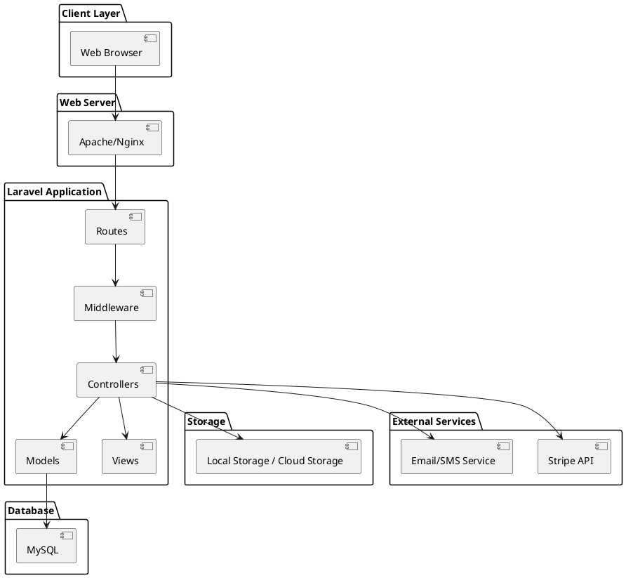
* Submiting an Artwork
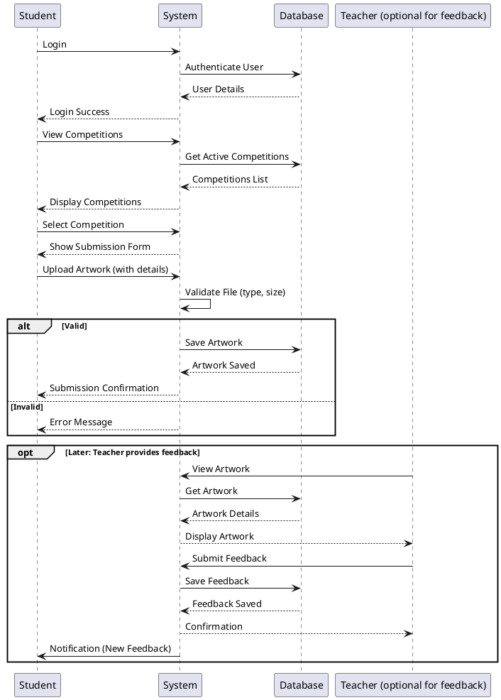

* Competition Creation
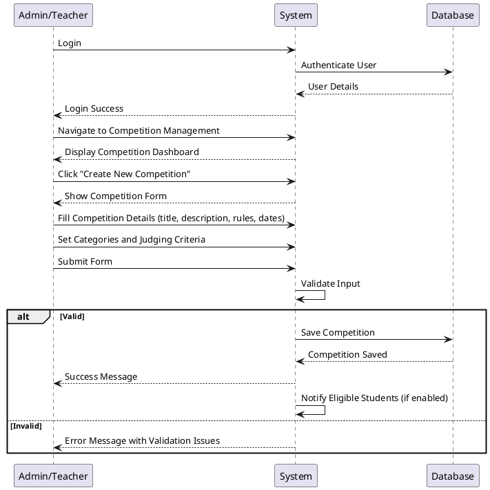
* Certificate Generation

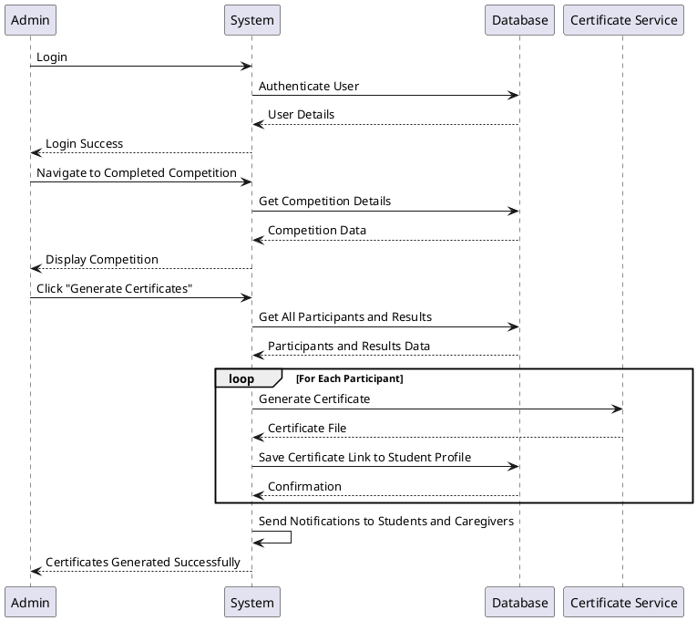
* Competition Finalization 
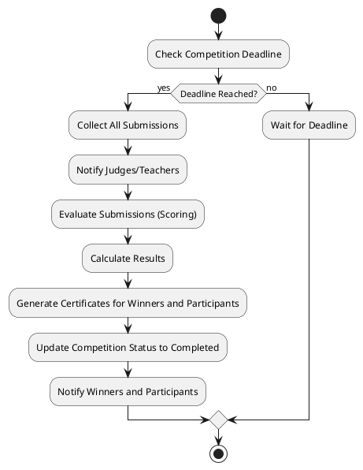
* Student Registration and Enrollement 
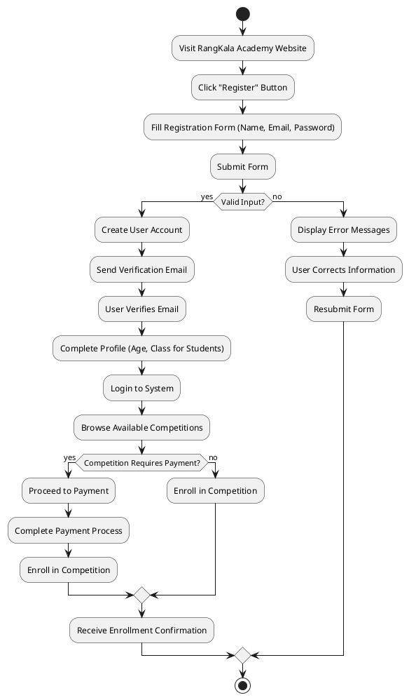
* Payment Processing 
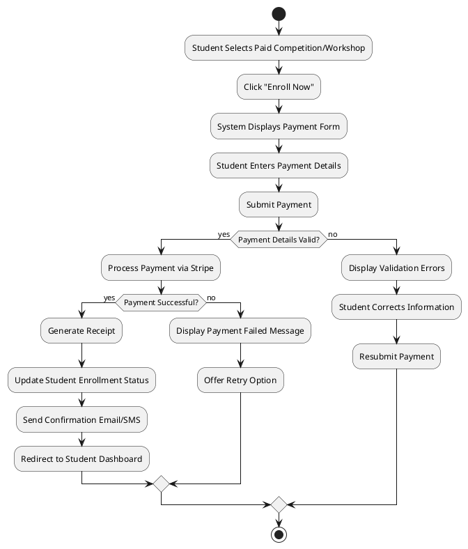
### 4.4 Use Cases

### UC-AT-001 — Create Competition
| Attribute | Value |
|---|---|
| Actor | Admin / Teacher |
| Description | Allows the Admin/Teacher to define all parameters for a new art competition. |
| Frequency of use | Medium |
| Triggers | Need to announce a new competition for students |
| Goals | Create a well-structured competition with clear rules and criteria |
| Pre-condition | User is logged in with Admin or Teacher role. |
| Post-condition | A new competition is added to the database and visible on the Competition page. |


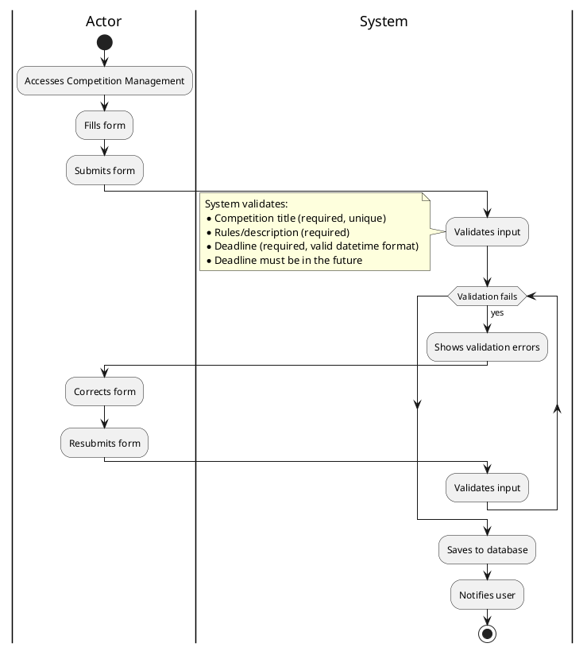

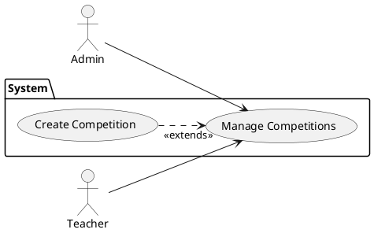

### UC-AT-002 — Edit Existing Competition
| **Attribute** | **Value** |
|---------------|-----------|
| **Actor** | Admin / Teacher |
| **Description** | Modify details, rules, or status of an existing competition. |
| **Frequency of use** | Medium (As needed for each competition) |
| **Triggers** | Need to update competition information or correct errors |
| **Goals** | Maintain accurate and up-to-date competition information |
| **Pre-condition** | User is logged in; Competition exists in the system. |
| **Post-condition** | Competition details are updated in the system. |

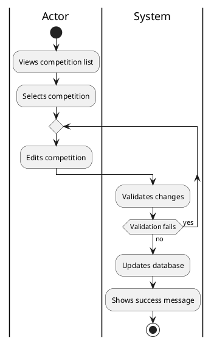
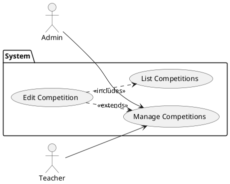

### UC-AT-003 — View Submissions
| Attribute | Value |
|---|---|
| Actor | Admin / Teacher |
| Description | View submitted artworks and assign scores/feedback. |
| Frequency of use | High (During competition evaluation periods) |
| Triggers | Students have submitted artworks requiring evaluation |
| Goals | Provide fair assessment and constructive feedback |
| Pre-condition | User is logged in; submissions exist for the competition. |
| Post-condition | Artworks are scored and feedback recorded. |

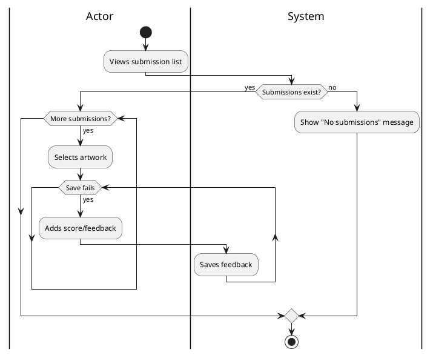

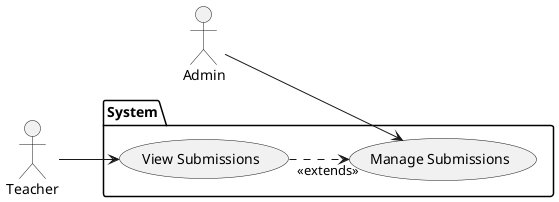

### UC-AT-004 —  Finalize Competition
| Attribute | Value |
|---|---|
| Actor | Admin / Teacher |
| Description | Finalize competition, calculate winners and publish results. |
| Frequency of use | Medium |
| Triggers | All submissions evaluated and scored |
| Goals | Determine winners and share results publicly |
| Pre-condition | All submissions reviewed and scored. |
| Post-condition | Competition status = Completed; results published. |

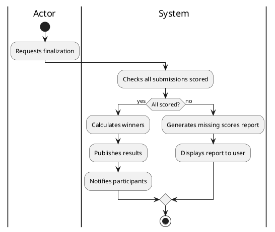
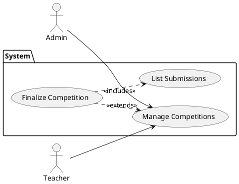
### UC-AT-005 — Customize Certificate Templates
| Attribute | Value |
|---|---|
| **Actor** | Admin |
| **Description** | Customize certificate templates (layout, logos, signatures). |
| **Frequency of use** | Low (Occasional) |
| **Triggers** | Branding or layout change needed |
| **Goals** | Prepare templates for consistent certificate generation |
| **Pre-condition** | Admin privileges |
| **Post-condition** | Template saved and used for future certificates |


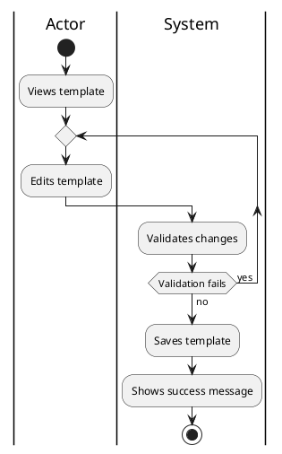
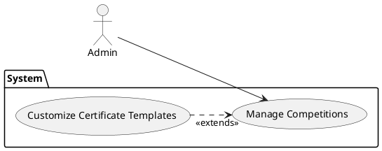
### UC-AT-006 — Create Student Accounts
| **Attribute** | **Value** |
|---------------|-----------|
| **Actor** | Admin |
| **Description** | Allows the Admin to create a new student account. |
| **Frequency of use** | Medium (Enrollment periods) |
| **Triggers** | New enrollment |
| **Goals** | Create a new student account with accurate information |
| **Pre-conditions** | Admin logged in |
| **Post-conditions** | New student account created |

```plantuml
@startuml
|Actor|
start
:Accesses User Management;
:Clicks 'Add New Student';
:Enters student details;
note 
Fields to enter:
* User table: name, email, password
endnote
:Selects class from dropdown;
:Saves account;
|System|
:Validates input;
note 
Validations:
* Name (required, alphabetic)
* Email (valid format, unique)
* Password (meets security requirements)
endnote
if (Valid?) then (yes)
  :Creates User record;
  :Creates Student record;
  :Notifies success;
else (no)
  :Shows errors;
endif
stop
@enduml
```
```plantuml 
@startuml
left to right direction
actor Admin as A
package System {
  usecase "Manage Users" as MU
  usecase "Create Student Accounts" as CS
}
A --> MU
CS ..> "<<extends>>" MU
@enduml
```
### UC-AT-007 — Generate Performance Reports/Analytics
| Attribute | Value |
|---|---|
| Actor | Admin / Teacher |
| Description | Generate reports on participation and performance. |
| Frequency of use | Medium (Periodic) |
| Triggers | Reporting needs |
| Goals | Provide insights and exports |
| Pre-condition | Sufficient data present |
| Post-condition | Reports generated and available |

```plantuml
@startuml
|Actor|
start
:Accesses Reports;
:Selects filters;
:Generates report;
|System|
:Processes request;
note 
Report generation may fail when:
* No data matches filters
* Database connection issues
* Invalid filter parameters
endnote
if (Success?) then (yes)
  :Displays report;
else (no)
  :Shows error;
endif
stop
@enduml
```
```plantuml 
@startuml
left to right direction
actor Admin as A
actor Teacher as T
package System {
  usecase "Manage Reports" as MR
  usecase "Generate Reports" as GR
  usecase "View Submissions" as VS
}
A --> MR
T --> MR
GR ..> "<<extends>>" MR
GR ..> "<<includes>>" VS
@enduml
```

### UC-AT-008 — Payment Transaction Management
| **Attribute** | **Value** |
|---------------|-----------|
| **Actor** | Admin |
| **Description** | Manage payment transactions and receipt generation. |
| **Frequency of use** | Medium (As payments occur) |
| **Triggers** | Payment transactions |
| **Goals** | Maintain financial records and issue receipts |
| **Pre-condition** | Payment gateway integrated |
| **Post-condition** | Receipt generated and linked |

```plantuml
@startuml
|Actor|
start
:Accesses Payments Dashboard;
:Views transactions;
:Selects transaction;11
:Generates receipt;
|System|
:Validates transaction status;
if (Completed?) then (yes)
  :Creates receipt PDF;
  :Stores receipt;
  :Sends to user;
else (no)
  :Shows error;
endif
stop
@enduml
```
```plantuml 
@startuml
left to right direction
actor Admin as A
package System {
  usecase "Manage Payments" as MP
  usecase "Track Payments" as TP
  usecase "Generate Receipts" as GR
}
A --> MP
TP ..> "<<extends>>" MP
GR ..> "<<extends>>" MP
TP ..> "<<includes>>" GR
@enduml
```
### UC-AT-009 — Send System Notification
| Attribute | Value |
|---|---|
| Actor | Admin / Teacher |
| Description | Compose and send notifications to users. |
| Frequency of use | Medium (As needed) |
| Triggers | Important events or updates |
| Goals | Inform relevant users promptly |
| Pre-condition | User authorized |
| Post-condition | Notification stored and delivered |

```plantuml
@startuml
|Actor|
start
:Accesses Notification System;
:Composes message;
:Selects audience;
:Sends notification;
|System|
:Validates message;
note 
Message invalid when:
* Empty subject/body
* Exceeds length limits
* Contains prohibited content
endnote
if (Valid?) then (yes)
  :Saves notification;
  :Delivers to users;
else (no)
  :Shows errors;
endif
stop
@enduml
```
```plantuml 
@startuml
left to right direction
actor Admin as A
actor Teacher as T
package System {
  usecase "Manage Notifications" as MN
  usecase "Send Notification" as SN
}
A --> MN
T --> MN
SN ..> "<<extends>>" MN
@enduml 
```
### UC-S-010 — Login to Student Dashboard
| Attribute | Value |
|---|---|
| Actor | Student |
| Description | Securely log in and access their personalized dashboard. |
| Frequency of use | High (Multiple times per week) |
| Triggers | Student needs to access their account and features |
| Goals | Securely authenticate and provide access to personalized student features |
| Pre-condition | Student account is registered and active. |
| Post-condition | Student is authenticated and redirected to their personal dashboard. |


```plantuml
@startuml
|Actor|
start
:Enters credentials;
:Submits login;
|System|
:Validates credentials;
if (Valid?) then (yes)
  :Redirects to dashboard;
else (no)
  :Shows error;
endif
stop
@enduml
```
```plantuml
@startuml
left to right direction
actor Student as S
package System { 
  usecase "View Student Dashboard" as VSD
}
S --> VSD
@enduml
```
### UC-S-011 — Upload Artwork for Competition
| Attribute | Value |
|---|---|
| Actor | Student |
| Description | Submits an artwork file for an ongoing competition. |
| Frequency of use | High |
| Triggers | Student has completed artwork and is ready to submit to a competition |
| Goals | Successfully submit artwork for evaluation in a competition |
| Pre-condition | Student is logged in; Competition is Ongoing. |
| Post-condition | Artwork is successfully uploaded, stored, and linked to the competition and student's profile. |

```plantuml
@startuml
|Actor|
start
:Selects competition;
:Uploads artwork;
:Adds metadata;
:Confirms submission;
|System|
:Validates file;
note 
Validation includes:
* File type (JPG/PNG)
* File size limits
* Malware scanning
endnote
if (Valid?) then (yes)
  :Stores file;
else (no)
  :Shows error;
endif
stop
@enduml
```
```plantuml
@startuml
left to right direction
actor Student as S
package System {
  usecase "Upload Artwork for Competition" as UA
}
S --> UA
@enduml
```

### UC-S-012 — Evaluate Submission
| Attribute | Value |
|---|---|
| Actor | Student |
| Description | Views comments and scores provided by the teacher/judge on submitted artworks. |
| Frequency of use | Medium (After evaluation is completed) |
| Triggers | Teacher has evaluated and provided feedback on submitted artwork |
| Goals | Understand evaluation results and identify areas for improvement |
| Pre-condition | Student is logged in; Artwork has been reviewed by the teacher. |
| Post-condition | Student gains insight into their performance and areas for improvement. |

```plantuml
@startuml
|Actor|
start
:Accesses Portfolio;
|System|
:Checks for artworks;
if (Artworks exist?) then (yes)
  :Displays artworks;
else (no)
  :Shows empty message;
endif
stop
@enduml
```
```plantuml
@startuml
left to right direction
actor Student as S
package System {
  usecase "View Personal Portfolio" as VPP
  usecase "List Submissions" as LS
}
S --> VPP
VPP ..> "<<includes>>" LS
@enduml
```

### UC-S-013 — View Certificates
| Attribute | Value |
|---|---|
| Actor | Student |
| Description | Views details of a specific certificate. |
| Frequency of use | Low (After certificate generation and when needed) |
| Triggers | Student selects a certificate to view |
| Goals | View certificate details |
| Pre-condition | Student is logged in; Certificate exists. |
| Post-condition | Certificate details are displayed. |

```plantuml
@startuml
|Actor|
start
:Accesses Certificates;
|System|
:Displays certificate list;
|Actor|
:Selects certificate;
|System|
:Displays certificate details;
stop
@enduml
```
```plantuml
@startuml
left to right direction
actor Student as S
package System {
  usecase "View Certificate" as VC
  usecase "List Certificates" as LC
}
S --> VC
VC ..> "<<includes>>" LC
@enduml
```

### UC-S-014 — Register for Competition
| Attribute | Value |
|---|---|
| Actor | Student / Caregiver |
| Description | Enrolls the student for an upcoming competition. |
| Frequency of use | Medium (When new competitions are announced) |
| Triggers | New competition announcement and student's interest in participation |
| Goals | Successfully register for a competition |
| Pre-condition | User is logged in; Competition is Upcoming. |
| Post-condition | Student is registered for the competition. |

```plantuml
@startuml
|Actor|
start
:Views competitions;
:Selects competition;
:Registers;
|System|
:Processes registration;
:Confirms registration;
stop
@enduml
```
```plantuml
@startuml
left to right direction
actor Student as S
actor Caregiver as P
package System {
  usecase "Manage Competitions" as MC
  usecase "Register for Competition" as RC
}
S --> MC
P --> MC
RC ..> "<<extends>>" MC
@enduml
```

### UC-S-015 — Update Artwork
| Attribute | Value |
|---|---|
| Actor | Student |
| Description | Updates metadata for individual artwork submissions. |
| Frequency of use | Medium (When correcting artwork information or updating categorization) |
| Triggers | Need to correct or update artwork metadata |
| Goals | Maintain accurate artwork information and categorization |
| Pre-condition | Student is logged in; Artwork exists; Submission deadline has not passed. |
| Post-condition | Artwork metadata is updated in the system. |


```plantuml
@startuml
|Actor|
start
:Accesses Portfolio;
|System|
:Displays artwork list;
|Actor|
:Selects artwork;
|System|
:Checks deadline;
if (Before deadline?) then (yes)
  :Allows editing;
  |Actor|
  :Edits artwork metadata;
  note 
  Editable metadata:
  * Title
  * Description
  * Category
  * Art style
  * Tags
  endnote
  :Saves changes;
  |System|
  :Updates artwork record;
else (no)
  :Blocks editing;
  stop;
endif
stop
@enduml
```
```plantuml
@startuml
left to right direction
actor Student as S
package System {
  usecase "Update Artwork" as UA
  usecase "List Artworks" as LA
}
S --> UA
UA ..> "<<includes>>" LA
@enduml
```

### UC-S-016 — Update Personal Profile Details
| Attribute | Value |
|---|---|
| Actor | Student |
| Description | Allows the student to edit non-critical personal details (e.g., profile picture, contact information). |
| Frequency of use | Low (When personal information changes) |
| Triggers | Need to update personal information or preferences |
| Goals | Maintain accurate and current personal profile information |
| Pre-condition | Student is logged in. |
| Post-condition | Student's profile details are updated in the system. |


```plantuml
@startuml
|Actor|
start
:Accesses Profile Settings;
:Edits profile details;
note 
Non-critical fields that can be updated:
* Profile picture (not used for identification)
* Contact information (phone, address)
* Bio/About me
* Preferences (notifications, privacy settings)
endnote
:Saves changes;
|System|
:Validates input;
if (Valid?) then (yes)
  :Updates profile;
else (no)
  :Shows error;
endif
stop
@enduml
```

```plantuml
@startuml
left to right direction
actor Student as S
package System {
  usecase "Manage Profile" as MP
  usecase "Update Profile" as UP 
}
S --> MP
UP ..> "<<extends>>" MP
@enduml
```

### UC-P-017 — Monitor Child's Submissions
| Attribute | Value |
|---|---|
| Actor | Caregiver |
| Description | Allows the Caregiver to view all artworks submitted by their child. |
| Frequency of use | Medium (After child submits new work) |
| Triggers | Caregiver wants to view their child's submitted artworks |
| Goals | Stay informed about child's artistic activities and submissions |
| Pre-condition | Caregiver is logged in; At least one child is linked to the Caregiver's account. |
| Post-condition | Caregiver can see all child submissions. |

```plantuml
@startuml
|Actor|
start
:Accesses Dashboard;
|System|
:Checks for children;
if (Multiple children?) then (yes)
  |Actor|
  :Selects child;
else (no)
  :Proceeds with child;
endif
|Actor|
:Views child's submissions;
|System|
:Checks for submissions;
if (Submissions exist?) then (yes)
  :Displays submissions;
else (no)
  :Shows empty message;
endif
stop
@enduml
``` 
```plantuml
@startuml
left to right direction
actor Caregiver as P
package System {
  usecase "Monitor Submissions" as MS
  usecase "View Submissions" as VS
}
P --> MS
MS ..> "<<includes>>" VS
@enduml
```
### UC-P-018 — View Teacher Feedback on Child's Work
| Attribute | Value |
|---|---|
| Actor | Caregiver |
| Description | Enables the Caregiver to view teacher comments and scores on their child's artworks. |
| Frequency of use | Medium (After teacher evaluation is completed) |
| Triggers | Teacher has evaluated child's artwork and provided feedback |
| Goals | Understand child's performance and areas for improvement |
| Pre-condition | Caregiver is logged in; At least one child is linked to the Caregiver's account. |
| Post-condition | Caregiver is informed about the child's work quality and progress. |

```plantuml
@startuml
|Actor|
start
:Accesses Dashboard;
:Selects child;
:Selects artwork;
|System|
:Checks for feedback;
if (Feedback available?) then (yes)
  :Displays feedback;
else (no)
  :Shows pending message;
endif
stop
@enduml
```
```plantuml
@startuml
left to right direction
actor Caregiver as P
package System {
  usecase "View Child Feedback" as VCF
  usecase "View Submissions" as VS
}
P --> VCF
VCF ..> "<<includes>>" VS
@enduml
```

### UC-AT-019 — Delete Competition
| **Attribute** | **Value** |
|---------------|-----------|
| **Actor** | Admin |
| **Description** | Allows the Admin to permanently remove an archived (completed) competition and its data from the active system. |
| **Frequency of use** | Low (Occasionally when cleaning up old competitions) |
| **Triggers** | Need to remove old competition data or free up system resources |
| **Goals** | Clean up system by removing unnecessary competition data |
| **Pre-conditions** | Competition is finalized; User has Admin privileges. |
| **Post-conditions** | Competition record is removed (or soft-deleted/archived) from the active database. |

```plantuml
@startuml
|Actor|
start
:Accesses Competition Management;
:Selects competition;
:Requests deletion;
|System|
:Shows confirmation;
if (Confirmed?) then (yes)
  :Deletes competition;
  :Archives data;
  :Notifies success;
else (no)
  :Cancels deletion;
endif
stop
@enduml
```
```plantuml
@startuml
left to right direction
actor Admin as A
package System {
  usecase "Manage Competitions" as MC
  usecase "Delete Competition" as DC
  usecase "List Competitions" as LC
}
A --> MC
DC ..> "<<extends>>" MC
DC ..> "<<includes>>" LC
@enduml
```
### UC-AT-020 — Reset Student Password

| **Attribute** | **Value** |
|---------------|-----------|
| **Actor** | Admin |
| **Description** | Allows the Admin to reset a student's password manually for account recovery purposes. |
| **Frequency of use** | Low (When students forget passwords and can't use self-service) |
| **Triggers** | Student requests password reset and cannot use automated recovery |
| **Goals** | Restore student access to their account |
| **Pre-conditions** | Admin is logged in; Student requests a password reset. |
| **Post-conditions** | Student's password is reset to a temporary value, and they are notified. |

```plantuml
@startuml
|Actor|
start
:Accesses User Management;
:Requests student list;
|System|
:Displays student list;
|Actor|
:Selects student;
:Requests password reset;
|System|
:Generates new password;
:Updates account;
:Notifies student;
stop
@enduml
```
```plantuml
@startuml
left to right direction
actor Admin as A
package System {
  usecase "Manage Users" as MU
  usecase "Reset Password" as RP
}
A --> MU
RP ..> "<<extends>>" MU
@enduml
```
### UC-S-021 — Edit Uploaded Artwork Details

| **Attribute** | **Value** |
|---------------|-----------|
| **Actor** | Student |
| **Description** | Allows the student to modify the title, description, or categorization of an uploaded artwork before the submission deadline. |
| **Frequency of use** | Medium (Before submission deadlines) |
| **Triggers** | Need to correct or update artwork information |
| **Goals** | Ensure accurate artwork metadata before final submission |
| **Pre-conditions** | Student is logged in; Submission deadline has not passed. |
| **Post-conditions** | Artwork metadata is updated in the database. |

```plantuml
@startuml
|Actor|
start
:Accesses Portfolio;
:Selects artwork;
|System|
:Checks deadline;
if (Before deadline?) then (yes)
  :Allows editing;
  |Actor|
  :Edits details;
  note 
  Editable details:
  * Title
  * Description
  * Category
  * Art style
  * Tags
  endnote
  :Saves changes;
  |System|
  :Updates database;
else (no)
  :Blocks editing;
  stop;
endif
stop
@enduml
```
```plantuml
@startuml
left to right direction
actor Student as S
package System {
  usecase "Manage Portfolio" as MP
  usecase "Edit Artwork" as EA
  usecase "View Portfolio" as VP
}
S --> MP
EA ..> "<<extends>>" MP
EA ..> "<<includes>>" VP
@enduml
```
### UC-AT-022 — Create Teacher Accounts

| **Attribute** | **Value** |
|---------------|-----------|
| **Actor** | Admin |
| **Description** | Allows the Admin to create a new teacher account. |
| **Frequency of use** | Low (During hiring) |
| **Triggers** | New teacher hiring |
| **Goals** | Create a new teacher account with appropriate access |
| **Pre-conditions** | Admin logged in |
| **Post-conditions** | New teacher account created |


```plantuml
@startuml
|Actor|
start
:Accesses User Management;
:Enters teacher details;
:Saves account;
|System|
:Validates input;
note 
Invalid when:
* Missing required fields
* Invalid email format
* Email already exists
endnote
if (Valid?) then (yes)
  :Creates account;
  :Sends welcome email;
else (no)
  :Shows errors;
endif
stop
@enduml
```
```plantuml
@startuml
left to right direction
actor Admin as A
package System {
  usecase "Manage Users" as MU
  usecase "Create Teacher Accounts" as CT
  usecase "List Teachers" as LT
}
A --> MU
CT ..> "<<extends>>" MU
CT ..> "<<includes>>" LT
@enduml
```

### UC-AT-023 — View Student Account Details
| Attribute | Value |
|---|---|
| Actor | Admin |
| Description | Views the details of a selected student account. |
| Frequency of use | High (As needed) |
| Triggers | Need to check student information |
| Goals | Retrieve and display student account information |
| Pre-conditions | Admin logged in; Student selected from list |
| Post-conditions | Student details displayed |

```plantuml
@startuml
|Admin|
start
:Accesses User Management;
:Requests student list;
|System|
:Displays student list;
|Admin|
:Selects student;
|System|
:Displays student profile;
note 
Admin can view:
* Account details (name, email, class)
* Portfolio (artworks, submissions)
* Feedback and scores
* Certificates
endnote
stop
@enduml
```
```plantuml
@startuml
left to right direction
actor Admin as A
actor Student as S
package System {
  usecase "View Student Profile" as VSP
  usecase "List Students" as LS
}
A --> VSP
S --> VSP
VSP ..> "<<includes>>" LS
@enduml
```
### UC-AT-024 — Update Student Account

| **Attribute** | **Value** |
|---------------|-----------|
| **Actor** | Admin |
| **Description** | Allows the Admin to update the details of an existing student account. |
| **Frequency of use** | Medium (As needed) |
| **Triggers** | Student information changes |
| **Goals** | Maintain accurate student account information |
| **Pre-conditions** | Admin logged in; Student account exists |
| **Post-conditions** | Student account details updated or error message displayed |

```plantuml
@startuml
|Actor|
start
:Accesses User Management;
:Requests student list;
|System|
:Displays student list;
|Actor|
:Selects student;
:Edits details;
:Saves changes;
|System|
:Validates input;
note 
Validates:
* Name (required, alphabetic)
* Email (valid format, unique)
* Class (valid option from list)
* Contact info (valid format if provided)
endnote
if (Valid?) then (yes)
  :Updates account;
else (no)
  :Shows errors;
endif
stop
@enduml
```
```plantuml
@startuml
left to right direction
actor Admin as A
package System {
  usecase "Manage Users" as MU
  usecase "Update Student Account" as USA
}
A --> MU
USA ..> "<<extends>>" MU
@enduml
```
###  UC-AT-025 — Deactivate Student Account

| **Attribute** | **Value** |
|---------------|-----------|
| **Actor** | Admin |
| **Description** | Allows the Admin to deactivate a student account (soft delete). |
| **Frequency of use** | Low (When student leaves or account is no longer needed) |
| **Triggers** | Student leaves the institution or account needs to be disabled |
| **Goals** | Disable student account while retaining data |
| **Pre-conditions** | Admin logged in; Student account exists |
| **Post-conditions** | Student account deactivated or process cancelled |

```plantuml
@startuml
|Actor|
start
:Accesses User Management;
:Requests student list;
|System|
:Displays student list;
|Actor|
:Selects student;
:Requests deactivation;
|System|
:Shows confirmation;
if (Confirmed?) then (yes)
  :Deactivates account;
  :Notifies success;
else (no)
  :Cancels deactivation;
endif
stop
@enduml
```

```plantuml
@startuml
left to right direction
actor Admin as A
package System {
  usecase "Manage Users" as MU
  usecase "Deactivate Student Account" as DSA
}
A --> MU
DSA ..> "<<extends>>" MU
@enduml
```
### UC-AT-026 — View Teacher Account Details
| **Attribute** | **Value** |
|---------------|-----------|
| **Actor** | Admin |
| **Description** | Allows the Admin to view the details of an existing teacher account. |
| **Frequency of use** | Medium (As needed) |
| **Triggers** | Need to check teacher information |
| **Goals** | Retrieve and display teacher account information |
| **Pre-conditions** | Admin logged in |
| **Post-conditions** | Teacher details displayed or appropriate message shown |

```plantuml
@startuml
|Actor|
start
:Accesses User Management;
:Requests teacher list;
|System|
:Displays teacher list;
|Actor|
:Selects teacher;
|System|
:Displays teacher details;
stop
@enduml
```

```plantuml
@startuml
left to right direction
actor Admin as A
package System {
  usecase "Manage Users" as MU
  usecase "View Teacher Details" as VTD 
}
A --> MU
VTD ..> "<<extends>>" MU
@enduml
```
### UC-AT-027 — Update Teacher Account
| **Attribute** | **Value** |
|---------------|-----------|
| **Actor** | Admin |
| **Description** | Allows the Admin to update the details of an existing teacher account. |
| **Frequency of use** | Medium (As needed) |
| **Triggers** | Teacher information changes or role changes |
| **Goals** | Maintain accurate teacher account information |
| **Pre-conditions** | Admin logged in; Teacher account exists |
| **Post-conditions** | Teacher account details updated or error message displayed |


```plantuml
@startuml
|Actor|
start
:Accesses User Management;
:Requests teacher list;
|System|
:Displays teacher list;
|Actor|
:Selects teacher;
:Edits details;
:Saves changes;
|System|
:Validates input;
if (Valid?) then (yes)
  :Updates account;
else (no)
  :Shows errors;
endif
stop
@enduml
```

```plantuml
@startuml
left to right direction
actor Admin as A
package System {
  usecase "Manage Users" as MU
  usecase "Update Teacher Account" as UTA
  usecase "List Teachers" as LT
}
A --> MU
UTA ..> "<<extends>>" MU
UTA ..> "<<includes>>" LT
@enduml
```
### UC-AT-028 — Deactivate Teacher Account
| **Attribute** | **Value** |
|---------------|-----------|
| **Actor** | Admin |
| **Description** | Allows the Admin to deactivate a teacher account (soft delete). |
| **Frequency of use** | Low (When teacher leaves or account is no longer needed) |
| **Triggers** | Teacher leaves the institution or account needs to be disabled |
| **Goals** | Disable teacher account while retaining data |
| **Pre-conditions** | Admin logged in; Teacher account exists |
| **Post-conditions** | Teacher account deactivated or process cancelled |


```plantuml
@startuml
|start|
:Accesses User Management;
:Requests teacher list;
|System|
:Displays teacher list;
|Actor|
:Selects teacher;
:Requests deactivation;
|System|
:Shows confirmation;
if (Confirmed?) then (yes)
  :Deactivates account;
  :Notifies success;
else (no)
  :Cancels deactivation;
endif
stop
@enduml
```

```plantuml
@startuml
left to right direction
actor Admin as A
package System {
  usecase "Manage Users" as MU
  usecase "Deactivate Teacher Account" as DTA
  usecase "List Teachers" as LT
}
A --> MU
DTA ..> "<<extends>>" MU
DTA ..> "<<includes>>" LT
@enduml
```
### UC-S-029 — List Portfolio
| Attribute | Value |
|---|---|
| Actor | Student |
| Description | Displays a summary view of the student's portfolio with thumbnail previews and basic artwork information. |
| Frequency of use | High (When accessing portfolio) |
| Triggers | Need to view portfolio overview |
| Goals | Display portfolio summary with visual previews |
| Pre-condition | Student is logged in |
| Post-condition | Portfolio summary is displayed |


```plantuml
@startuml
|Actor|
start
:Accesses Portfolio;
|System|
:Displays portfolio summary;
if (Artworks exist?) then (yes)
  :Shows thumbnail gallery;
  |Actor|
  :Can scroll through artworks;
  :View basic artwork info;
else (no)
  :Shows empty portfolio message;
endif
stop
@enduml
```
```plantuml
@startuml
left to right direction
actor Student as S
package System {
  usecase "List Portfolio" as LP
}
S --> LP
@enduml
```
### UC-S-030 — List Certificates

| Attribute | Value |
|---|---|
| Actor | Student |
| Description | Views a history of all earned certificates. |
| Frequency of use | Low (After certificate generation and when needed) |
| Triggers | Student wants to view their earned certificates |
| Goals | Access certificate history as proof of achievement |
| Pre-condition | Student is logged in. |
| Post-condition | Certificate history is visible. |

```plantuml
@startuml
|Actor|
start
:Accesses Certificates;
|System|
:Checks for certificates;
if (Certificates exist?) then (yes)
  :Displays certificate list;
else (no)
  :Shows empty message;
endif
stop
@enduml
```
```plantuml
@startuml
left to right direction
actor Student as S
package System {
  usecase "List Certificates" as LC
}
S --> LC
@enduml
```
### UC-S-031 — Export Certificates
| Attribute | Value |
|---|---|
| Actor | Student |
| Description | Downloads a certificate as a PDF file. |
| Frequency of use | Low (After certificate generation and when needed) |
| Triggers | Student wants to download a certificate |
| Goals | Retain certificate as proof of achievement |
| Pre-condition | Student is logged in; Certificate exists. |
| Post-condition | Certificate PDF is downloaded. |

```plantuml 
@startuml
|Actor|
start
:Accesses Certificates;
|System|
:Displays certificate list;
|Actor|
:Selects certificate;
:Requests download;
|System|
:Generates PDF;
:Initiates download;
stop
@enduml
```
```plantuml
@startuml
left to right direction
actor Student as S
package System {
  usecase "Export Certificate" as EC
  usecase "View Certificate" as VC
}
S --> EC
EC ..> "<<includes>>" VC
@enduml
```
### UC-S-032 — Make Payment
| Attribute | Value |
|---|---|
| Actor | Student / Caregiver |
| Description | Makes a payment for workshop fees or competition registration fees. |
| Frequency of use | Medium (When registering for paid activities) |
| Triggers | Registration for a paid workshop or competition |
| Goals | Complete payment for registration |
| Pre-condition | User is logged in; Activity requires payment. |
| Post-condition | Payment is processed; Registration is confirmed. |

```plantuml
@startuml
|Actor|
start
:Views activities;
:Selects activity (workshop/competition);
:Initiates payment;
|System|
:Redirects to payment gateway;
:Processes payment;
if (Payment successful?) then (yes)
  :Confirms payment;
  :Updates registration status;
  :Notifies user;
else (no)
  :Shows payment error;
endif
stop
@enduml
```
```plantuml
@startuml
left to right direction
actor Student as S
actor Caregiver as P
package System {
  usecase "Make Payment" as MP
}
S --> MP
P --> MP
@enduml
```
### UC-AT-033 — List Students
| Attribute | Value |
|---|---|
| Actor | Admin |
| Description | Lists all students in the system with search/filter capabilities. |
| Frequency of use | High (As needed) |
| Triggers | Need to view student list |
| Goals | Display list of students with filtering options |
| Pre-conditions | Admin logged in |
| Post-conditions | Student list displayed |

```plantuml
@startuml
|Actor|
start
:Accesses User Management;
:Requests student list;
|System|
:Displays student list;
|Actor|
:Enters search criteria;
|System|
:Filters student list;
if (Students found?) then (yes)
  :Displays filtered list;
else (no)
  :Shows "No students found" message;
endif
stop
@enduml
```
```plantuml
@startuml
left to right direction
actor Admin as A
package System {
  usecase "List Students" as LS
}
A --> LS
@enduml
```
### UC-AT-034 — List Teachers

| Attribute | Value |
|---|---|
| Actor | Admin |
| Description | Lists all teachers in the system with search/filter capabilities. |
| Frequency of use | High (As needed) |
| Triggers | Need to view teacher list |
| Goals | Display list of teachers with filtering options |
| Pre-conditions | Admin logged in |
| Post-conditions | Teacher list displayed |

```plantuml
@startuml
|Actor|
start
:Accesses User Management;
:Requests teacher list;
|System|
:Displays teacher list;
|Actor|
:Enters search criteria;
|System|
:Filters teacher list;
if (Teachers found?) then (yes)
  :Displays filtered list;
else (no)
  :Shows "No teachers found" message;
endif
stop
@enduml
```

```plantuml
@startuml
left to right direction
actor Admin as A
package System {
  usecase "List Teachers" as LT
}
A --> LT
@enduml
```
### UC-S-035 — List Artworks 
| Attribute | Value |
|---|---|
| Actor | Student |
| Description | Lists all artworks in the student's portfolio. |
| Frequency of use | High (When accessing portfolio) |
| Triggers | Need to view artwork collection |
| Goals | Display list of student's artworks |
| Pre-condition | Student is logged in |
| Post-condition | Artwork list is displayed |

```plantuml
@startuml
|Actor|
start
:Accesses Portfolio;
|System|
:Displays artwork list;
if (Artworks exist?) then (yes)
  :Shows artwork list;
else (no)
  :Shows empty portfolio message;
endif
stop
@enduml
```
```plantuml
@startuml
left to right direction
actor Student as S
package System {
  usecase "List Artworks" as LA
}
S --> LA
@enduml
```
### UC-S-036 — List Submissions
| Attribute | Value |
|---|---|
| Actor | Student |
| Description | Lists all artwork submissions made by the student. |
| Frequency of use | High (When accessing portfolio or checking submission history) |
| Triggers | Need to view list of submitted artworks |
| Goals | Display comprehensive list of student's artwork submissions |
| Pre-condition | Student is logged in |
| Post-condition | List of submissions is displayed |

```plantuml
@startuml
|Actor|
start
:Accesses Submissions;
|System|
:Retrieves submission data;
if (Submissions exist?) then (yes)
  :Displays submission list;
else (no)
  :Shows empty submissions message;
endif
stop
@enduml
```
```plantuml
@startuml
left to right direction
actor Student as S
package System {
  usecase "List Submissions" as LS
}
S --> LS
@enduml
```
## Wireframe Documentation

The complete set of wireframes created for the RangKala Art Academy Web Platform is provided in the file titled [Wireframe SDP1.pdf](Wireframe%20SDP1.pdf).
Here is the Wireframe Link for better understanding[ Wireframe made through Figma](https://decal-pages-78653604.figma.site/)  
This document includes:

- Low-fidelity screen sketches for all user roles (Admin, Teacher, Student, Caregiver)  
- Page layout structure for core modules such as Competitions, Portfolio, Certificates, and Payments  
- Navigation flow diagrams illustrating how users move between screens  
- Interface component placement and interaction notes

These wireframes serve as the visual foundation for the system’s UI/UX design and guide the development of the platform's front-end structure.

---
## Improvements from Previous Report (IT483)

Compared with the previous IT483 report, several major improvements were made in this project. In the earlier phase, the focus was mainly on planning, initial system design, and basic implementation of the art competition management system. In SDP2, the project was further enhanced by improving functionality, security, testing, and overall system reliability.

One major improvement was the completion of core modules such as artwork submission, competition management, payment verification, grading, certificate generation, and notification handling. In addition, validation rules were strengthened to reduce invalid user input and improve data accuracy.

The database structure was also refined by improving relationships between users, competitions, artworks, payments, and notifications. This helped reduce redundancy and ensured smoother data retrieval.

Another important improvement was the introduction of formal testing procedures, including unit testing, integration testing, system testing, and acceptance testing. These testing activities helped identify system weaknesses and improve the overall quality of the application.

---

## 4.4 Testing

The system was tested using automated unit, feature, integration, and system-level testing to validate both individual components and workflows. The selection of modules for rigorous testing was based on **Functional Criticality** and **Cyclomatic Complexity**, prioritizing core business logic and high-complexity algorithms (such as the competition scoring workflow) to ensure logical coverage and reliability.

### 4.4.1 Testing Plan

The Testing Plan outlines a structured and systematic approach to evaluating the system’s functionality, performance, and security. The testing process was carried out over a five-month period (**January 2026 – May 2026**), allowing sufficient time for comprehensive validation, iterative improvements, and alignment with the overall software development lifecycle.

#### Schedule Overview

- **Unit Testing (Early January – Mid February 2026)**  
  Unit testing was conducted during the final stages of development to verify the correctness of individual components. This included validating all decision branches in complex logic (**Cyclomatic Complexity > 10**) and ensuring edge cases were handled.

- **Integration Testing (Mid February – Early March 2026)**  
  This phase focused on validating the interaction between different system modules, including user authentication, artwork submission, payment processing, and certificate generation.

- **System Testing (March 2026)**  
  System testing involved evaluating the complete and integrated system against the defined functional and non-functional requirements.

- **Load and Stress Testing (Late March – Early April 2026)**  
  Load and stress testing were performed to assess system performance under varying levels of user demand.

- **Security and Performance Testing (April 2026)**  
  This phase ensured that the system is secure and optimized, utilizing tools like **OWASP ZAP**.

- **Acceptance Testing (Late April – Early May 2026)**  
  Acceptance testing was conducted with the involvement of the project supervisor and client to verify that the system meets all specified requirements.

---

## 4.4.2 Unit Tests

Unit testing focuses on verifying the smallest testable parts of the application. In addition to standard positive flows, **Edge Cases** (boundary values) and **Negative Cases** (invalid inputs) were systematically defined and executed to ensure robustness.

### Tools Used

- **PHPUnit** (Laravel’s built-in testing framework)
- **Laravel RefreshDatabase** trait for isolated test execution

### Scope & Test Cases

Unit tests validated the following workflows and scenarios:

| Module | Test Case Type | Scenario | Expected Result |
| :--- | :--- | :--- | :--- |
| **User Auth** | Negative | Login with invalid password format (less than 8 characters). | System rejects input with validation error. |
| **User Auth** | Edge | Attempt login with incorrect credentials for the 5th consecutive time. | Account `is_locked` flag is set to `1`; access denied. |
| **Image Upload** | Negative | Upload file with extension `.exe` or `.php`. | System rejects file; “Invalid type” error returned. |
| **Image Upload** | Edge | Upload image with file size exactly at the 5MB limit. | Validated correctly at boundary. |
| **Payment** | Positive | Model validates payment status transitions correctly. | Status moves from `pending` to `completed`. |
| **Certificate** | Positive / Edge | Generate certificate for a name with 1 character vs. 50 characters. | Text renders dynamically without overlapping. |

### Unit Test Results Summary

All unit tests executed successfully, confirming correct behavior of core system components:

- Artwork model relationships validated ✔
- Certificate model relationships validated ✔
- Soft deletion functionality verified ✔
- Competition relationships validated ✔
- Payment data integrity verified ✔
- Notification system validated ✔
- User role management validated ✔

### Bug Tracking

- **Tracking Tool:** GitHub Issues
- **Classification Levels:** Critical, High, Medium, Low

**Common issues resolved included:**

- Missing database columns in the test environment
- Incorrect model relationship naming (for example, `student_id` vs. `user_id`)
- Storage path mismatches in certificate generation logic

---

## 4.4.3 Integration Tests

Integration testing ensures that multiple modules work together correctly as a complete system. It verifies data flow between controllers, models, services, and external components such as file storage and notifications.

### Objectives of Integration Testing

The main objectives include:

- Ensuring the payment system correctly updates payment status and enables artwork submission
- Verifying that artwork uploads are correctly stored in both the filesystem and database
- Ensuring grading actions trigger notifications to caregivers
- Validating the certificate generation workflow after grading approval
- Ensuring role-based access controls function correctly across modules

### System Workflow Tested (Including Negative Scenarios)

| Module | Test Case Type | Scenario | Expected Result |
| :--- | :--- | :--- | :--- |
| **Competition Flow** | Positive | User pays fee → Status updates → User uploads artwork | Artwork record created only if payment status is `completed`. |
| **Notification** | Positive | Teacher grades artwork → Feedback saved | `notifications` table receives entry; student receives email. |
| **Caregiver Link** | Negative | Caregiver attempts to view a student not linked in `caregiver_student` | Access denied (`403 Forbidden`). |
| **Database** | Edge | Attempt to delete a user who has existing artworks | Soft delete applied; user marked inactive; artworks remain. |

### Integration Results Summary

All integration tests passed successfully, confirming proper communication between system modules:

- Payment module integration ✔
- File upload system integration ✔
- Notification system integration ✔
- Grading workflow integration ✔
- Certificate generation workflow integration ✔

A total of **54 automated tests passed with 95 assertions**, confirming system stability.

---

## 4.4.4 System Testing

System testing evaluates the integration of the application to ensure it meets all functional and non-functional requirements specified during system design.

### Functional Testing

The following key features were tested at system level:

- Competition creation and management (Admin / Teacher)
- Student artwork submission system
- Payment processing and validation
- Certificate generation workflow
- Notification system for grading and feedback
- Role-based dashboards (Admin, Teacher, Student, Caregiver)

All functional requirements were verified and confirmed to be working as expected.

### Interface Testing

Interface testing ensured smooth navigation and usability across all user roles:

- Admin dashboard functionality and navigation
- Teacher grading interface usability
- Student submission and portfolio management interface
- Caregiver dashboard and monitoring features
- Cross-role navigation consistency

### Compatibility Testing

- **Deployment Environment:** Localhost environment using a PHP-supported stack (Laravel development server)
- **Browser Compatibility:** Verified across modern web browsers including **Google Chrome**, **Microsoft Edge**, and **Mozilla Firefox**
- **File Storage and Retrieval:** Images and uploaded files are stored using PHP storage mechanisms (`storage/app` with symbolic linking via `public/storage`)
- **Database Connectivity:** Successfully tested using local database configuration (**MySQL through Laragon**)

### System Test Results Summary

The system performed reliably under all tested conditions:

- No critical system failures observed
- All modules functioned correctly in the integrated environment
- Performance remained stable under normal usage conditions
- UI responsiveness remained consistent across browsers

The system achieved a **100% automated test success rate**:

- **Total Tests:** 54
- **Assertions:** 95
- **Failures:** 0

---

### 4.4.4.1 Load and Stress Tests

To ensure the platform can handle concurrent users during competition deadlines, load and stress testing was conducted.

#### Tools

- **k6**

#### Scenarios

- **Load Test:** Simulating **50 concurrent users** accessing the system homepage and core routes
- **Stress Test:** Testing system limits under heavier traffic scenarios (planned: **100+ concurrent users** and large file submissions) to identify breaking points

#### Results (50 Concurrent Users)

- **Average Response Time:** ~4.46 seconds
- **Median Response Time:** ~4.58 seconds
- **95th Percentile (p95):** ~4.73 seconds
- **Maximum Response Time:** ~5.79 seconds
- **Throughput:** ~8.75 requests/second
- **Error Rate:** 0% (no failed requests observed)

#### Analysis

The system demonstrated stable performance under concurrent load, maintaining a **0% error rate** across all test runs. Response times remained consistent, indicating no major instability or request failures.

The observed average response time (~4.5 seconds) is within the acceptable performance range for the defined system requirements. Minor delays are expected due to the use of Laravel’s development server (`php artisan serve`), which is not optimized for production-level concurrency.

#### Metric Target

Server response time should remain around **5 seconds or below** under normal load.

---

### 4.4.4.2 Security and Performance Tests

Security testing is especially important because the platform handles both data relating to minors and financial transactions.

#### Performance Tests

Performance evaluation focused on:

- Measuring page load times for image-heavy pages
- Optimizing database queries to keep retrieval times below the **5-second** requirement

#### Security Testing

Security assessment was performed using **OWASP ZAP**.

##### Tool Used

- **OWASP ZAP**

##### Testing Approach

- Automated vulnerability scanning was performed on key application routes, including authentication endpoints such as `/login` and `/register`
- The system was subjected to repeated and structured requests to simulate malicious behavior, including input manipulation and unauthorized access attempts
- Observations were made based on both vulnerability alerts and system response behavior during scanning

##### Results

- No **high-risk vulnerabilities** were detected
- Several **low-risk** and **informational** issues were identified, but nothing critical was found

##### Performance During Security Scan

- **Average Response Time:** ~755 ms
- **Median Response Time:** ~719 ms
- **Maximum Response Time:** ~2.9 seconds
- **Request Failures:** 0

##### Analysis

The system demonstrated stable and consistent behavior under simulated attack conditions. All tested endpoints responded correctly without errors or unexpected failures, indicating resilience against repeated and potentially malicious requests.

The identified issues were primarily configuration-related rather than critical vulnerabilities. These do not pose immediate threats but indicate areas for further strengthening before production deployment.

##### Authentication and Access Control

Testing confirmed that:

- Protected routes require proper authentication
- No unauthorized access or authentication bypass was observed during the testing process

---

## 4.4.4 Acceptance Testing

Acceptance testing was conducted to determine whether the system satisfies user expectations and project objectives. Several users were asked to interact with the system, including lecturers and selected students who represented the expected end users.

The participants tested important system functions such as account registration, login, competition creation, artwork submission, payment submission, grading, and certificate generation. After testing, users provided feedback regarding usability, functionality, and overall performance.

Most participants reported that the system was easy to use and that the workflow was clear. They were able to complete tasks successfully without major issues. A few suggestions were made regarding interface clarity and notification visibility, which were noted for future improvements.

Overall, the users accepted the system as functional and suitable for managing online art competitions.

### Acceptance Test Summary Table

| Test Activity | Expected Result | Actual Result | Status |
|---|---|---|---|
| User registration | User account created successfully | Account created successfully | Pass |
| User login | User accesses dashboard | Dashboard displayed correctly | Pass |
| Competition creation | Competition saved in database | Competition saved successfully | Pass |
| Artwork submission | Artwork uploaded and recorded | Artwork submitted successfully | Pass |
| Payment submission | Payment proof uploaded | Payment stored successfully | Pass |
| Grading artwork | Score and feedback saved | Grading successful | Pass |
| Certificate generation | Certificate downloadable | Certificate generated successfully | Pass |

##### Key Results Summary

- **Authentication and Access Control**
  - Protected route authentication: **4.83 / 5**
  - Role-specific access restriction: **4.67 / 5**
  - Credential validation during login: **4.50 / 5**

- **Navigation and Usability**
  - Post-login redirection: **4.50 / 5**
  - Role-based feature accessibility: **4.67 / 5**
  - Ease of navigation: **4.67 / 5**

- **Competition and Payment Workflow**
  - Competition detail display: **4.50 / 5**
  - Deadline and fee display: **4.20 / 5**
  - Checkout process clarity: **4.33 / 5**
  - Payment completion success: **4.17 / 5**
  - Receipt generation: **4.50 / 5**

- **Artwork Submission**
  - Successful artwork upload: **4.83 / 5**
  - Smooth upload process: **4.33 / 5**
  - File validation (size and format): **4.17 / 5**
  - Submission failure feedback: **4.00 / 5**

- **Certificates and Feedback**
  - Certificate generation: **4.67 / 5**
  - Certificate viewing/download: **4.67 / 5**
  - Grading feedback clarity: **4.40 / 5**

##### Interpretation

The results indicate that users were generally satisfied with the platform’s usability and functionality. The highest-rated areas were **authentication enforcement** and **artwork upload functionality**, both receiving **4.83 / 5**.

Relatively lower ratings were observed in **submission failure feedback (4.00 / 5)** and **payment completion/file validation (4.17 / 5)**, suggesting minor usability improvements may still be beneficial.

Overall, the acceptance test confirms that the system is **functionally ready for deployment**, with all major workflows operating correctly and positively evaluated by end users.

## 4.5 Implementation Details

The implementation of the RangKala Art Academy Web Platform is built using the Model-View-Controller (MVC) architecture provided by the Laravel Framework. This architecture ensures a clear separation of concerns, improving maintainability, scalability, and testability of the system.

---

### Relevant Algorithms and Logic

#### Certificate Generation Algorithm
The certificate generation process is implemented as a **server-side image processing algorithm** using the Intervention Image library.

When an administrator or teacher manually triggers certificate generation from the grading interface, the system executes the following steps:

1. Retrieve artwork data from the database (student, competition, score).
2. Check if a certificate already exists for the given artwork to prevent duplicates.
3. Load a pre-designed certificate template image from storage.
4. Dynamically overlay text such as:
   - Student name
   - Competition title
   - Date of issuance
5. Optionally overlay a signature image onto the certificate.
6. Generate a final image (PNG format).
7. Save the generated certificate file to storage.
8. Create a corresponding database record in the `certificates` table.

This approach ensures that certificates are generated dynamically and uniquely for each artwork.

---

#### Image Processing Pipeline
The system uses the **Intervention Image library** for handling image uploads and manipulation.

Upon artwork submission:

- The system validates uploaded files (image type and size constraints).
- Images are processed and optionally resized for consistency.
- Processed images are stored in the server file system.
- The file path is saved in the database for retrieval.

This ensures optimized storage usage and consistent image rendering across the platform.

---

#### Role-Based Access Control (RBAC)
The system implements **role-based middleware authorization** to restrict access based on user roles:

- Admin: Full system access including user management, competitions, and certificate generation.
- Teacher: Access to grading, competitions, and student evaluation.
- Student: Access limited to submissions, portfolio, and certificates.
- Caregiver: Read-only access to associated student data.

Middleware checks are applied on all protected routes to prevent unauthorized access.

---

### Technical Background

#### Eloquent ORM
The application uses Laravel’s Eloquent ORM for database interactions, enabling:

- Simplified relationship management (One-to-Many, Many-to-Many)
- Reduced reliance on raw SQL queries
- Protection against SQL injection vulnerabilities
- Clean and readable data querying syntax

---

#### Notification System
Laravel’s built-in notification system is used to notify caregivers when:

- A student artwork is graded
- Feedback is submitted by teachers or administrators

Notifications are stored in the database and can be viewed in the user dashboard.

---

#### File Storage System
Laravel’s storage abstraction layer is used for:

- Storing artwork uploads
- Saving generated certificates
- Managing template assets (certificate layout, signatures)

This ensures environment-independent file handling and secure storage management.

--- 


# 5. Conclusion

During the development of this project, several challenges were encountered. One major challenge involved managing relationships between multiple database tables such as users, competitions, artworks, and payments. At the early stage, foreign key issues caused problems when deleting or updating records. This was solved by carefully redesigning relationships and adjusting constraints.

Another challenge involved validating user input properly. Some users were able to submit incomplete or invalid data. To solve this problem, stronger validation rules were implemented both in the frontend and backend.

Generating certificates and handling file uploads also required troubleshooting. File paths and storage management initially caused missing file errors. This issue was resolved by improving file storage handling and organizing uploaded files more carefully.

Testing also revealed small issues related to notifications, duplicate submissions, and incorrect redirections. These were gradually fixed during debugging and retesting.

Through these challenges, the project became more stable, reliable, and easier to use.

## 5.1  Troubleshooting Approaches

Several troubleshooting approaches were applied during development. Instead of only fixing errors when they appeared, test scenarios were created to intentionally reproduce problems. This made debugging easier and helped identify the exact causes of failures.

For example, when payment submission and artwork submission caused unexpected errors, the process was broken down into smaller parts and tested step by step. This method helped isolate the source of the issue more quickly.

Another useful approach was reviewing database relationships first whenever system errors appeared. Since many functions depended on linked tables, checking the database structure often made debugging faster than only checking code.

These troubleshooting methods improved development efficiency and reduced repeated errors.

## 5.2 Future Works

Although the system is functional, several improvements can still be made in the future.

First, a real-time notification system can be added so users immediately receive updates when competitions are created, payments are approved, or results are published.

Second, advanced reporting and analytics features can be introduced for administrators to better monitor participation, payment activity, and competition performance.

Third, the user interface can be further improved to make navigation more intuitive and visually appealing.

Finally, future development may include mobile responsiveness improvements or a dedicated mobile application so users can participate more conveniently from smartphones and tablets.

---

## 6 Appendix  

### 6.1 Future Works

While the current system meets the core requirements, several enhancements are planned for future iterations:  

*   **AI-Based Art Feedback**: Integration of Machine Learning APIs to provide preliminary automated feedback on artwork composition.
*   **Mobile Application**: Developing a dedicated React Native or Flutter mobile app for students to capture and upload photos directly.
*   **Virtual Reality (VR) Gallery**: A 3D virtual gallery feature where students and parents can walk through an exhibition of submitted artworks.
*   **Live Class Integration**: Incorporating video conferencing tools directly into the teacher dashboard.

### 6.2 Software Cost Estimation (financial cost, human cost, and time)  

A detailed breakdown of the costs associated with the development and maintenance of the RangKala Art Academy system.

| Cost Category | Description | Estimated Cost (INR) | Estimated Cost (USD) |
| :--- | :--- | :--- | :--- |
| **Financial Cost** | Domain Registration (1 year) | ₹1,000 | $11.40 |
| | Cloud Hosting (VPS - 1 year) | ₹8,000 | $91.20 |
| | SSL Certificate | ₹1,500 | $17.10 |
| | **Total Financial Cost** | **₹10,500** | **$119.70** |
| **Human Cost** | Developer (Student Project) | ₹0 (Academic) | $0 |
| | Client Consultation Time | ₹0 (In-kind) | $0 |
| | **Total Human Cost** | **₹0** | **$0** |
| **Time Cost** | Requirement Analysis | 4 Weeks | - |
| | Design & Prototyping | 4 Weeks | - |
| | Development & Coding | 8 Weeks | - |
| | Testing & Deployment | 4 Weeks | - |
| | **Total Duration** | **20 Weeks** | **~5 Months** |

#### 6.2.1 Documentation  

The technical documentation package for the RangKala Art Academy system includes the following components, which will be maintained and updated throughout the system lifecycle:

*   **Data Dictionary**: A comprehensive repository defining all data elements (e.g., student details, artwork metadata, payment records), their data types, constraints, and relationships within the MySQL database schema.
*   **Data Flow Diagrams (DFD)**: Visual representations illustrating how data moves from user inputs (Registration, Upload) through the system processes (Controllers) to storage (Database) and output (Certificates, Dashboards).
*   **Object Models**: UML Class diagrams defining the structure of the system's objects (User, Artwork, Competition) and their inheritance/association relationships.
*   **Screen Layouts**: Wireframes and final UI designs created in Figma defining the placement of navigation bars, forms, and galleries to ensure UX consistency.
*   **System Request**: The original formal document submitted by the client requesting the automation of the academy's manual processes.

#### 6.2.2 Operations Documentation  

*   **Installation Process**:
    1.  Clone the repository from GitHub.
    2.  Run `composer install` to install PHP dependencies.
    3.  Copy `.env.example` to `.env` and configure database credentials.
    4.  Run `php artisan key:generate` to set the application key.
    5.  Run `php artisan migrate` to set up the database tables.
    6.  Run `npm run build` to compile frontend assets.
*   **Users’ Roles**:
    *   **Administrator**: Full system access, user management.
    *   **Teacher**: Competition management, grading, feedback.
    *   **Student**: Portfolio management, competition submission.
    *   **Caregiver**: Monitoring child progress, viewing reports.
*   **Scheduling Information**: Automated cron jobs are scheduled daily at 11:00 PM to back up the database and check for expired competitions.
*   **Input/Output Files**:
    *   *Input*: JPG/PNG files (Origin: Student Device -> Destination: Server Storage).
    *   *Output*: PDF Certificates (Origin: Server -> Destination: Student Email/Dashboard).
*   **Security Requirements**: Administrators are required to change passwords every 90 days. Session cookies expire after 15 minutes of inactivity.

#### 6.2.3 User Documentation

  **FAQs**
*   **Q: What file formats are accepted for artwork submissions?**  
    *   **A:** The platform currently accepts **JPG** and **PNG** formats only. Each file must be under **5MB** and should have sufficient resolution for proper evaluation.
*   **Q: How do I reset my password?**  
    *   **A:** Click on the **"Forgot Password"** option on the login page. Enter your registered email address, and a secure password reset link will be sent to you.
*   **Q: When will certificates be available?**  
    *   **A:** Certificates are generated by **teachers or administrators after the artwork has been reviewed and scored**. Once generated, students can access and download them from the **"My Certificates"** section of their dashboard.
*   **Q: Is the registration fee refundable if I withdraw my submission?**  
    *   **A:** No, registration fees are **non-refundable** once the payment status is marked as **"Completed"**, in accordance with Rang Kala Academy’s policy.
*   **Q: How is my artwork judged and scored?**  
    *   **A:** All submissions are evaluated by teachers/admin. After review, scores along with detailed feedback are published in the **"My Artworks"** section of your dashboard.
*   **Q: Can a caregiver manage multiple students?**  
    *   **A:** Yes, a caregiver account can be linked to multiple student profiles, allowing centralized management of submissions and progress tracking from a single dashboard.

## Summary

The development of the RangKala Art Academy Web Platform represents a meaningful step toward modernizing the academy’s operations and enhancing the learning experience for students. By combining competition management, portfolio building, certificate automation, payment handling, and Caregiver monitoring into one unified system, this project directly addresses the challenges faced in the current manual workflow. The platform is designed to be user-friendly, secure, and scalable, ensuring that students, teachers, caregivers, and administrators all benefit from a more organized,and engaging environment.

Through the use of reliable technologies such as Laravel, MySQL, and Bootstrap, the system ensures long-term sustainability while keeping development cost-effective. The feasibility study confirms that the proposed solution is both practical and aligned with the academy’s mission of nurturing creativity and supporting young artists. Ultimately, this project aims to transform the way RangKala Art Academy operates—streamlining tasks, reducing errors, and empowering students to explore their artistic potential in a structured, supportive digital space.


## Additional Documentation

### PHP  
https://www.php.net/docs.php  

### JavaScript  
https://developer.mozilla.org/en-US/docs/Web/JavaScript  

### Laravel  
https://laravel.com/docs/11.x  

### VS Code  
https://code.visualstudio.com/Docs  

### Tailwind CSS  
https://v2.tailwindcss.com/docs  

### DataTables  
https://datatables.net/manual/  

### Node.js  
https://nodejs.org/api/all.html  

### NPM  
https://docs.npmjs.com/  

### Composer  
https://getcomposer.org/doc/00-intro.md  

### MySQL  
https://dev.mysql.com/doc/

